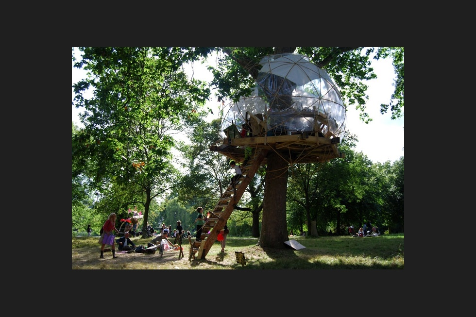

% Shushing 101
% Peter Organisciak
% Fall 2018

# User and Access Services

# Today

Welcome!

- About Me
- Course Overview
- Administration
- About you
- Tips
- Introduction to Library Services

----

----

### About Me

----

### Course Overview

> "The library is a distinctly social phenomenon and as such is susceptible to all the influences that react upon our social structure." - Jesse Shera, 1933

----

This course is about libraries as service providers, and the relationships of those services to users.

We're looking at _roles_ and _needs_

----

{class="plain"}

Easy enough...

-----

.. but what happens as user needs shift?

{class="plain"}

----

{class="plain"}

----

Think of _User and Access Services_ as the first part of a two-year class.

We're establishing the foundation to build on through your MLIS.

---------

### Topics

>- Instruction
>- Information behavior
>- Information literacy
>- Outreach
>- Assessment, evaluation
>- Library as space
>- Serving different population groups
>- Changing environments and services

----

### Learning Outcomes

-----

### About you

Learn something about your partner and tell the rest of the class.

- What are your career goals? What's an interesting thing about yourself? Do you have pets? What do you do in your free time? What's your first language? Why University of Denver? Why LIS? What's your least favorite thing about school? Do you like or hate _Inception_?

------

- syllabus overview
- assignments
- Canvas
- labs

-----

## Office Hours

Book at [https://organisciak.youcanbook.me](https://organisciak.youcanbook.me)

Generally: Wed 11-1, with other times added when possible

-----

### Group Preference

- Type of library or archive
- Age group
- Name, section

-----

# BREAK

Let's take a break.

_If you have a computer, now's a good time for the two optional surveys: one on your preference of target group for the marketing proposal, and one allowing you to volunteer for the earlier deadline for the Information Literacy Instruction assignment._

----

# Introduction

----

### Who does the library serve?

>- Patron?
>- Client?
>- Customer?
>- User?
>- Guest

----

### Types of Needs

>- _Normative_ needs - those based on expert opinion
>- _Felt_ needs - community reactions to a problem or issue
>- _Expressed_ needs - actionable beliefs - what users *do* rather than *say*
>- _Comparative_ needs - those that noted relative to similar institutions and communities

----

_Normative, felt, expressed, or comparative?_

- Noting a dearth of space for patrons with laptops, a library moves less popular books off-site to add community space.
- Seeing the growth of makerspaces as a service in larger communities, a library budgets to add their own.
- A study finds that children participating in after-school reading programs score better in literacy testing.
- A library in a largely Chinese community hires more Mandarin-speaking librarians.

----

Not all needs can be addressed, and some conflict with each other.

Why?

>- budget issues
>- time, space
>- The values of experts and communities may misalign

----

_taking a step back to contextualize..._

----

### Four Basic Roles of Libraries

>1. _Acquiring_ materials deemed valuable or useful
>2. _Storing_ and _preserving_ those materials
>3. _Organizing_ materials for efficient access
>4. _Providing assistance_ to individuals in locating information

Evans (p.5)

>- _In this class, we look at access (3) and services (4)_

----

### Broad Library Types

>- Public
>- Academic
>- Corporate / Private
>- School
>- Special

-----

### ALA Code of Ethics

<http://www.ala.org/tools/ethics>

------

# Users

----

"Librarians who flinch at the word _customer_ are operating out of an outmoded paradigm. This older paradigm portrays the library as a "public good" with as high a ranking on the 'goodness' scale as the national flag, parenthood, and apple pie. However... unless it adopts and masters the language and techniques of its competitors, it faces a future of declining support and significance.""

 - Darlene Weingand, _Customer service excellence : a concise guide for librarians_, 1997

-----

>- Do you agree? Disagree?
>- Even if _customer_ feels icky... what would the _customer service_ lens entail?

------

- Thinking beyond service _offerings_ - including _quality_ and _satisfaction_
- Assessment - surveys, interviews
- Understanding the user, listening and responding
- Setting expectations
- avoiding unhappy users
- emphasizing communication in librarianship > dealing with people is central!

Evans

# Next Week

-----

- Two optional preference surveys, on Canvas.
   - Topics for marketing proposal group project
   - Volunteer for week 6 deadline for information literacy instruction assignment

- Post on the _Introductions_ forum
  - _Introduce myself again?_ - This is for the benefit of myself and your classmates - we can refer back to it.

- Lab #1 discussion, on Canvas

------

# Overflow: Library Spaces

*Are we ahead of schedule? A bit from next week...*

----

## Library Experiences

Who has been to Anderson Academic Commons?

-----

>physical library 'is a place where cultural, social, and intellectual exchanges occur, often mediated by the resources in the library collection'

- Mardis 2011

----

[A search for 'library spaces'](https://www.google.com/search?q=library+spaces&rlz=1C1GGRV_enUS761US761&tbm=isch&tbo=u&source=univ&sa=X&ved=0ahUKEwj6ifbfkqDWAhVh1oMKHermCCMQsAQIdQ)

----

Are libraries for books, or for people?

>- Librarians disagree
>- Patrons disagree

----

------

### Multiple Spaces, aka the _Death of Shushing_

Libraries, especially public libraries, are increasingly trying to design around multiple spaces and multiple uses.

----

What spaces do we usually see in a public library?

>- Quiet, loud
>- media spaces
>- children's reading spaces
>- toddler, baby, family activity areas
>- multimedia, gaming
>- computer labs
>- book club, meeting spaces
>- book stores
>- music areas
>- archives
>- display areas

------

[Auraria Public Library Spaces](https://library.auraria.edu/about/spaces)

------

- [Denver ideaLAB](https://www.denverlibrary.org/meeting-rooms-branches)
- [BLDG 61: Boulder Library Makerspace](https://boulderlibrary.org/bldg61/)
- [MakeLab Auraria](https://library.auraria.edu/makelab)

-----

[Children's Activity and Learning Center, Thailand](https://www.designboom.com/architecture/24h-architecture-childrens-activity-and-learning-center-thailand/)

-----

Temporary Tree House Gallery in Regent's Park

----

- [How do Americans use Libraries](http://www.pewinternet.org/2016/09/09/libraries-2016/)
- [ALA Public Library Factsheet](http://www.ala.org/tools/libfactsheets/alalibraryfactsheet06)
-------
