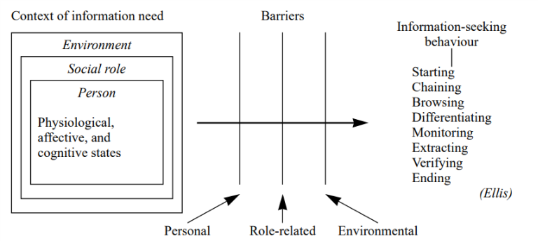

% Information Seeking Behavior
% Peter Organisciak
% Fall 2017

# Administration

## Schedule
- Wrap up introduction
- Groups for assignment #3
- Intro to bibliographies
- Instruction schedules
- Lab reading assignment
- Information seeking behavior

--------

## Groups

------

## Annotated bibliography

- A list of citations to materials accompanied by a short annotation
    - [How to prepare an annotated bibliography](http://guides.library.cornell.edu/annotatedbibliography) - Michael Engle, Cornell University library
- 2 pages, 10-15 citations

------

Next week's lab: Types of Libraries

------

# Other stuff

>- Extra readings

--------

# Information behavior

>- "the totality of human behavior in relation to sources and channels of information, including both active and passive information-seeking and information use" - Wilson 1999

-------

- Today's class is likely the most theoretical in this quarter
  - Consider these models throughout the course

-------

- Sense-Making - Dervin
- Anomalous States of Knowledge - Belkin
- Wilson's General Models
- Ellis' Model of Information Behavior
- Berry-Picking - Bates
- Communities of Practice - Davies
- Information Search Process - Kuhlthau

--------

{class="plain"}

-------

{class="plain"}

-------

- What types of passive search or ongoing search do you perform? In what way?

-------

## Ellis model

_Starting - Chaining - Browsing - Differentiating - Monitoring - Extracting - Verifying - Ending_

>- _starting_: beginning activities, e.g. asking some knowledgeable colleague
>- _chaining_: following footnotes and citations or
‘forward’ chaining through citation indexes
>- _browsing_: semi-directed or semi-structured searching
>- _differentiating_: using differences in information sources as a way of filtering for useful information

-------

## Ellis model

_Starting - Chaining - Browsing - Differentiating - Monitoring - Extracting - Verifying - Ending_

>- _monitoring_: keeping up-to-date
>- _extracting_: selectively identifying relevant material
>- _verifying_: checking information accuracy
>- _ending_: 'tying up loose ends'

-------

{class="plain"}

-------

## Chaining

- [Forward chaining on Google Scholar](https://scholar.google.com/scholar?q=wilson+information+behavior)

-------

## Kuhlthau's Information Search Process

- alternate conceptual framework to Ellis, more experiential
- focus on active search
- considers thoughts, feelings, and actions

-------

- _Initiation_ - person realizes a lack of knowledge or understanding
- _Selection_ - a general area or problem is identified
- _Exploration_ - a survey of material, which can be intimidating or incompatible
- _Formulation_ - focusing your search
- _Collection_ - gathering relevant information
- _Presentation_ - putting the learning to use

-------

**Feelings**

- _Initiation_ - uncertainty
- _Selection_ - optimism
- _Exploration_ - confusion, frustration, doubt
- _Formulation_ - clarity
- _Collection_ - sense of direction/confidence
- _Presentation_ - relief (then satisfaction or dissatisfaction as you start to use the information)

-------

- Do you agree with this process? These emotions?
- Have you recently experienced confusion or frustration during the exploration step?
- Is this useful? How might we apply this framework?

-------

## Dervin - Sense-Making

- Associated with shift from information _sources_ to _users_
- considers _cognitive gap_
- used in reference interview techniques (describing situation-gaps-uses)
- focus on verbs rather than nouns, emphasizing the process

-------

## Belkin (1980) - Anomalous Ways of Knowing

- anomaly between the person's knowledge and their ability to achieve some goals
- explicit about _cognitive viewpoint_: "processing of information, whether perceptual or symbolic, is mediated by a system"
- Anomalous state exists between different mediated states of knowledge

-------

{class='plain'}

-------

## Bates (1989) - Berry-picking

-------

{class='plain'}

-------

{class='plain'}

-------

{class='plain'}

--------

Bates lists six more strategies for information-seeking:

- footnote chasing (Ellis' "backward chaining")
- Citation search (Ellis's "forward chaining")
- journal run
- area scanning (what's in the library next to the book you want?)
- subject searches in bibliographies and abstracting services
- author searching

------------------------

# For Next week

- Lab #2 will be in class. Read your reading!
