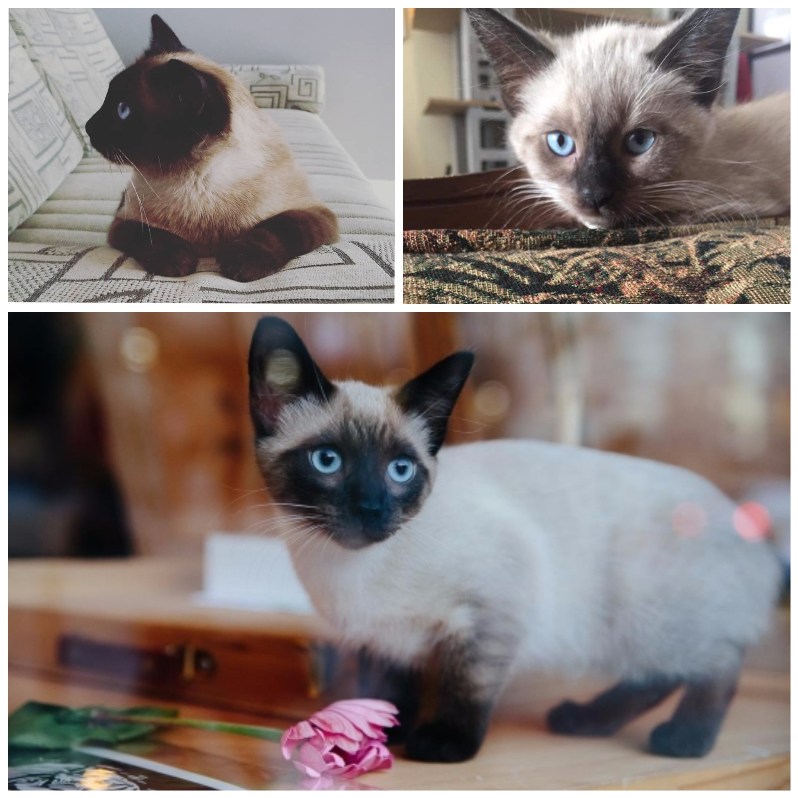

% Information services
% Peter Organisciak
% Fall 2018

# Administration

>- Did everybody access the readings okay?
>- Field trip
>- Cool stuff?

------

## Announcements?

- Philosophy mini-course from Jordan
- Online class
- Crimson Classic - 2.6mi run, next Thursday at 3
- [Denver Startup Week](https://www.denverstartupweek.org/)

------

## Kiki Watch

-----

## Pet Pics

{ height=500px }

Hadley

-----

## Lab \#3

-----

# Last Week wrap up

------

# Access Services

Traditional library roles - connecting people to materials

- circulation
- interlibrary loan
- signage
- shelving

-----

## Technical services

The beyond the desk work to improve access to materials; e.g. acquisitions, subscriptions

- Acquisitions
- Cataloguing
- Classification
- Subject access
- Authority control and linked open data
- Metadata standards

------

_What types of materials or documents do libraries provide access to?_

-----

## Acquisitions

- Moving to subscriptions and consortial access

- Varies greatly by library types
  - special libraries: going deep in a narrow area
  - academic libraries: monographs, serials / journals, faculty requests

------

## Acquisitions

- bibliographer recommendations
- trade publications
- working with intermediary vendors (Baker and Taylor, YBP, Blackwell)
    - library specifies material needs, and vendor automatically buys and ships materials

- Acquisitions Librarian - de-professionalizing (Helfer and Heinrich 2010)

------

## Interlibrary Loan

- Service for requesting materials from other libraries
- Expands the effective size of collection that a user has access to
- started early 20th century and grew in the ensuing decades

----

What are the problems with ILL?

>- For users
>     - speed and time
>     - occasional cost-sharing (e.g. photocopying)
>     - effort requesting
>- For libraries
>     - significant cost and effort
>          - Evans et al quote two libraries at \$28 and \$45/book

------

## Effort for ILL

- hardware/software, licensing
- record-keeping, planning (working with materials beyond your regular system)
- searching, picking, shipping

-----

## On-demand materials

>- Document delivery: order materials for a fee - digitized or shipped
>     - Sometimes delivered straight to users, particularly for special circumstances (e.g. rural patrons) or special materials (e.g. Braille books)
>- Twist on ILL: centralized sharing facilities
>- User-request acquisitions
>- Reciprocal borrowing: allowing members to 'cross' lines
>     - _When would this be useful? What types of libraries?_

------

_We'll return to technical services shortly. However, let's consider different types of libraries and library needs first._

-----

# Types of Libraries

-----

- What is distinct about your type of library?
- Who does your library serve? What roles do librarians play?
- What types of libraries are similar?
- Can you think of examples of the library? How you been to one?
- How common is your library?
- Who funds the library type?
- What facts surprised you from the reading? What outstanding questions does the article not answer?

-------

# Technical Services - cont.

----

## Cataloguing

- describing materials for collection access, after acquisition

- Guidelines:
   - Anglo-American Cataloging Rules (AACR) - 1967, AACR2 1988
   - Resource Description and Access (RDA)

------

- original cataloguing: creating a record from scratch
- copy cataloguing: starting with information from elsewhere

--------

# Vocabulary

From ODLIS (Online Dictionary of Library and Information Science):

-_bibliographic record_
An entry representing a specific item in a library catalog or bibliographic database, containing all the data elements necessary for a full description, presented in a specific bibliographic format.

-----

- Metadata: data about data (information about something)
- ODLIS: "Structured information describing information resources/objects for a variety of purposes."

--------

- three parts to cataloguing record: description, subject access and classification, and authority control

--------

## Subject access and classification

- subject analysis: what are the materials about?
  - uses a controlled vocabulary, like Library of Congress Subject Headings (LCSH), and Medical Subject Headings (MeSH)

- classification: assigning a call number in a classification scheme, like Library of Congress (LCC), Dewey Decimal (DDC), or Universal Decimal System (UDC)

------

## Library of Congress Subject Headings (LCSH)

<http://authorities.loc.gov/cgi-bin/Pwebrecon.cgi?DB=local&PAGE=First>

LCSH and LCC in context: [LOC online catalog](https://catalog.loc.gov/)

----------

## Authority control

- disambiguating strings from entities: connecting metadata to a central 'authority'

>- grouping authors with name variants, pseudonyms
>- Multiple versions of a work (translations, international version)
>- disentangling name matches
>- ISBN numbers, OCLC numbers

----

## Shared bibliographic databases

- [OCLC](https://www.oclc.org/en/home.html)
    - [WorldCat](https://www.worldcat.org/)

-------

## VIAF

- [Virtual International Authority File (VIAF)](https://viaf.org/)

---------

## LOD: Linked Open Data

- [DBPedia](http://dbpedia.org/page/Annot_(artist))
    - [SPARQL Search](https://goo.gl/F5Txbs)
- Freebase
- [LinkedMDB](http://data.linkedmdb.org/page/film/2014)
- New York Times - [Semantics API](https://github.com/NYTimes/public_api_specs/blob/master/semantic_api/semantic_api.md)

-------

----------------------

## Metadata standards

- MARC
- [Dublin Core](http://dublincore.org/documents/dcmi-terms/)
- METS (Metadata encoding and transmission standard)

----------

## FRBR (Functional Requirements for Bibliographic Records)

- Model for representing entities and relationships between works, as well as people
- RDA is the cataloguing standard based on this model

-----

-------------

- Where does FRBR over-simplify? Where might it be inadequate?

-------
