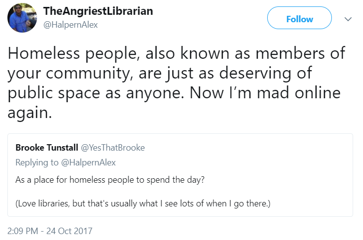

% Outreach; Underserved Populations
% Peter Organisciak
% Fall 2018

----------

# Administration

- Talking Book Library Trip
  - Oct 19th – 10am - SLA will send out a poll
- Instruction Assignment - Due Next Week
- Marketing Proposal - Due in Two Weeks
  - Deadline: Canvas had dates backwards

----------

## Announcements?

-------

## Kiki Watch

{height=550px}

-------

## Today

- Topic: Outreach services
- Marketing proposal

- Topic: Underserved populations
   - Findings from your annotated bibliographies

-------

# Outreach

-------

- What's outreach?
- Why?

-------

- focusing on services to infrequent users, nonusers, and traditionally underserved users

_For example?_

----

- poor, homeless, hungry
- immigrants, refugees, new Americans
- ethnically diverse people
- older adults
- adult new and non-readers
- incarcerated and ex-offenders
- people with disabilities
- LGBT populations
- rural and geographically isolated communities

(ALA - [Outreach Librarian](http://www.ala.org/educationcareers/libcareers/jobs/outreach),
[ODLOS - What We Do](http://www.ala.org/aboutala/offices/diversity/what-we-do))

-------

"services for nonusers"

Euphemism for community engagement, marketing

-----

-----

------

_What challenges may limit the access to services for these users?_

- hostile environments
- exclusive collections
- programs that don't address user experiences

------

## Traditionally under-served populations

- poor, homeless, hungry
- immigrants, refugees, new Americans
- ethnically diverse people
- people of color
- older adults
- adult new and non-readers
- incarcerated and ex-offenders
- people with disabilities
- LGBT populations
- rural and geographically isolated communities

-----

### Worksheet

First column - note challenges for the user population

--------

### Worksheet

Second column - brainstorm solutions for the various challenges

------

### Worksheet

Considering your solutions:

- What are potential hurdles for the solution?
- What's the feasibility of the solution?

-------

## Persons of Color and LGBT populations

_Idea time! How might we serve systematically underrepresented or discriminated populations?_

-------

From ODLOS ([1](http://www.ala.org/advocacy/diversity/outreachtounderservedpopulations/servicespeople), [2]()):

- provide collections and programs that reflect their experience
- promote library services through relevant channels and events
- [recruit](http://www.ala.org/advocacy/diversity/workforcedevelopment/recruitmentfordiversity) staff where all people see themselves represented (relevant: [resources for librarians facing discrimination](http://www.ala.org/advocacy/diversity/workplace/discrimination))

------

## Immigrant Populations

-------

## Serving Non-English Speakers

>- [ODLOS - Top10 'To-Dos' ](http://www.ala.org/aboutala/offices/olos/toolkits/servetheworld) (_Good list for it's directness - it's doable!_)

-------

## Homeless and poor populations

What issues do the poor and homeless encounter?

>- card and access policies required fixed address
>- conflation between trouble patrons and homeless
>- ill-trained or uncomfortable staff
>- limited promotion at relevant community centers
>- limited library access, re: transportation or hours
>- lack of relevant programs
>- source: [ODLOS](http://www.ala.org/advocacy/diversity/outreachtounderservedpopulations/servicespoor)

-----

-----

-------

## New Readers

-------

## Rural Populations

------

## Incarcerated

------

## Older Adults

-------

## Other groups

_What groups did you research for your bibliography? How can they be served?_

-------

## Recurring Themes

Discuss in new groups what types of themes we're seeing across our solutions.

------

## Bringing services to users

>- attending community events
>- classroom, camp, preschool visits
>- bookmobiles
>- little free libraries
>- Wheelie the Book Bike

------

---------

# Marketing

How do we serve 'non-users'?

--------

>- Information campaigns
>- Go to community centers
>- Bring services outside of the library
>- Assessment: make sure you're adapting to their needs!
>- Advocacy: make your case for value
>- Partnerships, presence at community events, Bookmobiles

---------

# Outreach Groups

- Time to meet with your groups!

------

# For next Week

- Instruction response

--------

# Services for Blind and Physically-Handicapped Users

Overflow - if there's extra time.

--------

###History

- late 19th c - Large libraries start collecting embossed books
    - expensive, unstandardized, local
- 1904 - Free Matter - mailing relevant materials for blind users is free
- 1917 - Revised Braille - US standard
- 1930s - Act to Provide Books for the Blind - establishing national library service
    - raised character books and audio books (talking books)

---------

- 1940s - appropriations to buy and distributed record players to loan to eligible readers
- 1960s - now formats - slowing records, using tape
    - tape also slowed down, so 'talking books' played 6hrs rather than 1.5hrs
- 1999 - Web-Braille: online access to Braille (for download and embossing; now knows as Braille and Audio Reading Download)
- 2000s - [ANSI/NISO Z39.86](http://www.niso.org/apps/group_public/download.php/14650/Z39_86_2005r2012.pdf) - Standard for the Digital Talking Book

-------

### Copyright

- braille doesn't compete with publisher profits, but talking books might!

- _Solutions?_

------

>- copyright permission and statements
>- strict controls: LOC-produced talking books were centralized at libraries, with limited materials
>- DRM for digital talking books

-----

1996:

> It is not an infringement of copyright for an authorized entity to reproduce or to distribute copies or phonorecords of a previously published, nondramatic literary work if such copies or phonorecords are reproduced or distributed in specialized formats exclusively for use by blind or other persons with disabilities.

--------

## Materials for the Blind

- Braille: embossed dots
- Sight-saving Type: large-print (>13pt)
- Talking books
- descriptive video

- talking books: created by the government
