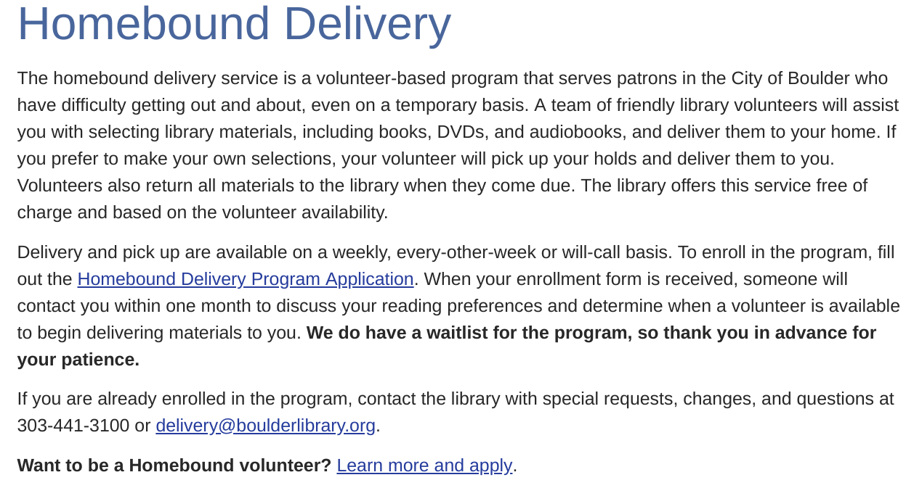

% Different Population Groups
% Peter Organisciak
% Fall 2018

----

## Today

- Accessibility
- Discussion of different types of groups

-----

{height=600px}

------

{height=600px}

------

## Administration

- This week's readings
- Next week: Program Plan

---

## Announcements?

--------

## Readers' Advisory

>- What is it?
>- Formal vs. informal
>- Historically non-fiction, drifted to fiction focus in late 20th century
>- Debates on role of librarian: encourage 'good' or 'popular' art?

Last week I felt like I didn't describe RA deeply enough.

On debates: non-judgmental approaches are the orthodoxy of the modern day, but some still think we should be encouraging 'good work'.

------

>- *Direct Readers' Advisory* - Based on interview/preferences of a patrons
>- *Indirect Readers' Advisory* - General recommendation of materials, or curation of lists

-----

What similar services are offered outside of libraries? Can we incorporate them into our services?

------

# Accessibility

-----

## Person-First Language

- stress the person first, then the adjective
- avoid defining people solely by the disability
- Use 'emotionally neutral expressions' (e.g. not 'stroke victim'; via APA Style guide)

*It takes practice!* No 'correct answer' and differences in preferences, so defer to the user or patron.

>- More ALA tips: avoid cutesy labels (e.g. 'differently abled'), consider trends ('special' is considered tired and potentially patronizing)
>- Person-first isn't universal, and some people find it awkward or less-preferred.

Communities that push pack against person-first: deaf and hard of hearing ('hearing-impaired' is well intentioned but emphasizes what can't be done, person who is deaf is clunky), homebound (no adequate alternatives, so it takes away or minimizes a need)

See recent thread: https://twitter.com/jeshyr/status/1041542826595516418

"I know you've all been programmed that "wheelchair bound” is the wrong phrase and that's true because there are better terms like "wheelchair users”. 

There are NO other terms for "bedridden” or "homebound” which actually convey the situation. These are the only words we have."

-------

## Low-mobility; Difficulty or inability to get around

> Because of illness or injury, need the aid of supportive devises such as crutches, canes, wheelchairs, and walkers; the use of special transportation; or the assistance of another person in order to leave their place of residence
>OR
>Have a condition such that leaving his or her home is medically contraindicated

(Medicare - Homebound Criteria 1)

Criteria 2: "The second criterion is that it is problematic for one to leave their home, and generally, the individual does not."

-----

-----

-----

>- building accessibility - elevator, automatic doors, braille signs, etc.
>- book delivery, book by mail
>- deposit collections
>- virtual reference

-----

## Training

Supporting services for people with various disabilities may involve service offerings or technologies, but very often requires adaptive behaviour from staff. Training and practice is needed!

[Library Accessibility Toolkits from The Association of Specialized Government and Cooperative Library Agencies (ASGCLA)](http://www.asgcladirect.org/resources/)

-----

## Autism Spectrum Disorder (ASD)

Language or social difficulties

Interactions:

>- be predictable and explain changes
>- determine preferable communication styles
>- don't make assumptions
>- communicate with the patrons (rather than turning to others)
>- be flexible on the behaviour that you accommodate (e.g. gum chewing, circulation policy)

_[More tips from ASGCLA](http://www.asgcladirect.org/resources/autism-spectrum-disorders-asd/)_

--------

## Autism Spectrum Disorder (ASD)

Services and Space:

>- Touchscreen devices; 'fidgets' (e.g. stress balls, tactile toys, spinners)
>- Visual materials (schedules, timers, due dates - show what and when)
>- Quiet, low-stimulation spaces; Full-spectrum or natural lighting

-----

## Deaf or Hard of Hearing

Interactions:

>- Speak naturally
>- Maintain eye contact
>- Rephrase words if necessary (e.g. "patrons may not hear quarter, but they may hear twenty-five cents.")

Services:

>- TTY (teleprinter)
>- Text reference services

(via ASGCLA)

------

## Technology problems

What are the ways that we interface with technology in libraries?

------

>- mouse
>- keyboard
>- screen (high-density, low-density)
>- touchscreens
>- speakers
>- game controllers

--------------

>- switches, large mice, large trackballs, joybox
>- color correction
>- screen-reading software
>- voice-to-text
>- smart pens
>- captioning, descriptive text
>- eye-tracking

-------

-----

{height=600px}

-----------

>- density scaling, magnification
>- stickykeys, filterkeys
>- extra large mouse pointers
>- high-contrast screen modes

-------

-------

https://www.ablenetinc.com/technology/switches

-----

<iframe width="560" height="315" src="https://www.youtube.com/embed/9fcK19CAjWM" frameborder="0" allow="autoplay; encrypted-media" allowfullscreen></iframe>

------

<iframe width="560" height="315" src="https://www.youtube.com/embed/rAIXE6ilRQ0" frameborder="0" allow="autoplay; encrypted-media" allowfullscreen></iframe>

-------

## Other web issues

- inaccessible text (e.g. in images)
- no alt text on images
- inaccessible or untested web design

-----

Exercise: considering complicating factors in daily media and technology.

- complete a task using touch-to-speech
- If you wear glasses, try to use your phone or computer without them (at arm's length if near-sighted, close up if far-sighted). See if any accessibility settings make it easier to read the news.
- Try to watch a Youtube video muted, with automatic captioning. How effective are the captions? Try to find a movie scene where you're familiar with the dialogue.
- Put on mittens and try to read a magazine. Go to the table of contents, find an article that looks interesting, then flip to that page.

-----

If you prefer not to perform the activity, identify a physical impairment or disability and consider the problems that it could reveal about traditional library materials and services. Be _thorough_:it is important to appreciate the depth and breadth of the challenges.

----
