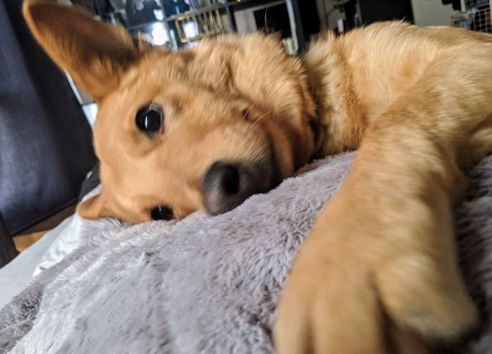
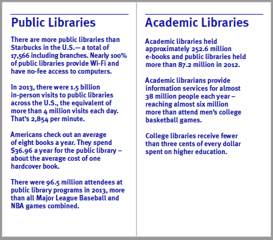

% The Present and Future of Services 1
% Peter Organisciak
% November 6, 2017

---------

## Today

- Presentations
- Accessibility and different population groups
- The Present and Future of Services - Part 1

------

-------

## Administration

- Announcements?
- class trip to the Talking Book Library
- RMIS happy hour - Nov 17, 6pm, Fermaentra

-------

- bilingual librarianship
- "Library-View"
- Don't leave behind older adults and rural users - we're still in a transition to digital
    - also: population is aging!
- more support for software that helps people with disabilities
- improved algorithmic knowledge extraction, text entailment, etc. (e.g. Watson)
- evolutions of libraries as space
- automatic checkouts
- "mini libraries" - library vending machines
- robots, VR: more hardware
- gamification; digital badges

Lab #5 Notes

-------

> The American Library Association’s Center for the Future of Libraries provides a fellowship for an individual or group interested in exploring the future of libraries.

>The fellowship offers a stipend of $10,000 to advance new ideas and perspectives for the future of libraries through the creation of a public product – report, white paper, video, resource, tool – that will help library professionals envision the future of library collections, partnerships, services, spaces, or technologies.

http://www.ala.org/tools/librariestransform/future/engage/fellowship

-------

# Funding

- library funding is nearly always as part of a larger organization, competing with other agencies for funds
    - This is the reality... so how do we work with that reality to continue high quality services?

------

- internal needs assessment - offer services that are inclusive but useful to your particular community
- externally: show your value
    - data first, not implied value
    - think back to assessment: how can you measure your impact in the community?

-------

- connected to data: evolving and pivoting
- advocacy
- making your case: clear plan/mission, able leadership, articulate link from needs to outcomes, realistic goals

---------

[Quotable Facts About America’s Libraries, ALA 2017](http://www.ala.org/aboutala/sites/ala.org.aboutala/files/content/quotable%20facts.2017.downloadable.pdf)

-----

## SROI - social return on investment

Tips from Evans et al. 2015, adapted from Lingane and Olsen 2004

- include positive and negative impacts of metrics
- focus on direct impacts rather than indirect
- don't double count
- be careful monetizing impacts
- contextualize data
- state all assumptions, test assumptions
- track impact over time

------

# Anonymity, Privacy and Ethics

_What impacts does online anonymity have on library services and users?_

---------

- can be used to damage
    - spreading offensive or bigoted material
    - illegal activities
- can also have a positive effect
    - role in intellectual freedom
    - provides community for people that don't want to participate publicly

- negative uses may require discussion, or make information literacy more important
- positive uses may need to be protected against blanket censorship

-------------

III. Libraries should challenge censorship in the fulfillment of their responsibility to provide information and enlightenment.

IV. Libraries should cooperate with all persons and groups concerned with resisting abridgment of free expression and free access to ideas.

- [Library Bill of Rights](http://www.ala.org/advocacy/intfreedom/librarybill)

-------

# Digital Preservation

-------

### Data curation in Academic Libraries

- Research Data Lifecycle - DataOne
-----

- Research Data Services
    - support, expertise
    - technical resources
- Institutional Repositories
    - 1st party hosting for scholarly research

-------

# Trends

- Trends - Center for the Future of Libraries
