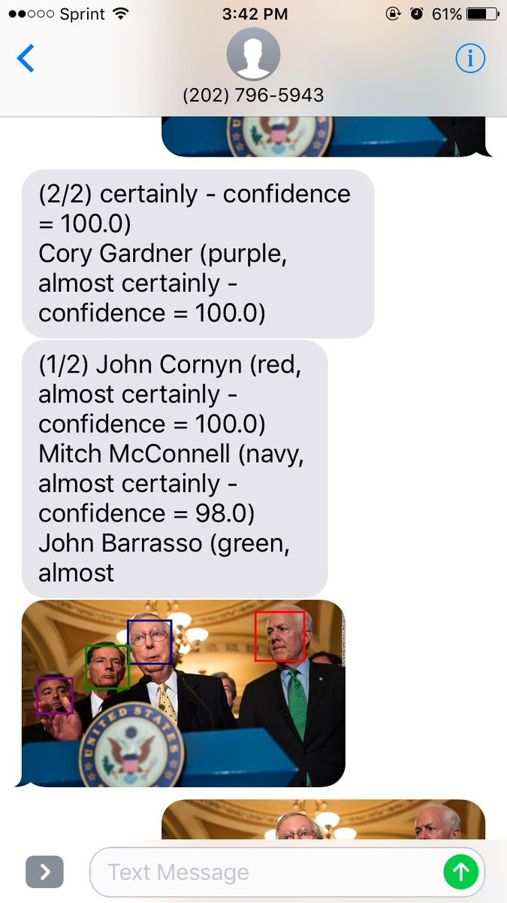

% The Present and Future of Services 1
% Peter Organisciak
% Fall 2018

---------

## Today

- Presentations
- Last week's readings
- The Present and Future of Services - Part 1
    - Funding, Data Curation, Anonymity, Trends, Copyright, Futurism

------

-------

## Pet Pics

{height=500px}

-------

## Administration

- Next class: online - see link in Canvas
- Testing Zoom link: Tuesday

-------

## Announcements

--------

# Presentations

-----------

# Different Population Group - Readings

--------

## Young Adult / Youth / Children's Information Needs and Behaviors

- YA: 12 through 18 (though constant discussion as to when to expand that age range)
- YA services
    - separate from Children since late 50s
- "Young adult services emphasize how library service can augment various internal and external assets that promote positive youth development in the categories of support, empowerment, boundaries and expectations, constructive use of time, commitment to learning, positive values, social competence, and positive identity."
- YA: Materials about identity, social lives beyond family, emotions
- Few libraries have YA Librarian (only big ones)
   - else: "youth services"
- Newfound autonomy paired with quickly changing trends makes YA Advisory Groups very common
- YA: patrons tend to congregate in groups, which can cause tension is spaces designed for solitude

Children:
- birth to age 11
- information-seeking: can't write well or read, not versed in search logic. Visual materials, reader's advisory are helpful
- spaces: fun designs, lower shelves, colorful, with toys
- types of services: promoting literacy, 

-------

## Lesbian, Gay, Bisexual, and Transgender Needs

- Stonewall Book Awards (formerly Gay Book): started in 1970
- Special collections and archives started to be established in the 70s
- Info-seeking behavior is greatly understudied
    - Unknowns: LGBT together, or separately?
- Great dissatisfaction in information institutions: most sources are friends and family
- Needs
    - Information about identity and the coming-out process
    - Particular mental or physical health resources

-------

## Older Adults' Information Needs and Behavior

- demographic is growing
- 60 or 65 and up
- subgroups: young aged (60-74), the old-old (75-84), and the 'oldest old' (85)
    - LIS often clumps these into a single group, but there are internal advocates for changing that, noting the usefulness of the subgroups
- Needs:
    - loneliness, dealing with loss, death and dying, aging process, fear of crime
- Aging and quality of life is changing, and baby boomers will have different needs as a result
- Materials: mass media (tv, magazines, news, radio); some reliance on professionals among old-old and oldest-old
- Resistance to technology - this is changing, but there's still a lag, while tech is growing more complex

-------

## Latinx and U.S. Libraries: History

- pronounce: "Latin-Ex"
- Demographics vary broadly: important to learn your own community
- Labels: Latino/a refer to people from Latin America, 'Hispanic' seemingly excludes non-spanish speaking or over-emphasizes colonial Spanish roots
- LIS focus on latinx services fairly recent (since 1970s). REFORMA started in 1973
- foreign-language materials, signage, staff
    - Because of US demographics, spanish-speaking services have been most common
- School and higher-ed materials have followed from laws that added more language course requirements
- In profession: based on just one year (2003), 3% of MLIS recipients are latinx
    - REFORMA established to connect and support latinx librarians

--------

## Black Americans and U.S. Libraries: History

- In early 20th c, African-American leaders sought to establish black libraries after being deined service at other public libraries.
    - appealed to Carnegie for support, and Carnegie grants helped build many black specific libs
    - Jim Crow laws and segregation led to black libraries, ironically feeding into the need for education and professionalization for black librarians
         - Atlanta University, Howard
- Northern libraries were integrated, though discrimination was common and upward mobility for black librarian was tough.
    - Article profiles some of those early librarians
- Large disparities in % of population served between white and black patrons
- ALA didn't have any exclusion policies for black Americans. After the annual meeting was in segregated Richmond (1936) ALA passed a full equality resolution (subsequently keeping the ALA conference out of the south for 2 decades)

--------

# Libraries in Changing Environments

Today and next week, we'll be looking at various small topics related to library evolution and planning for the future

--------

## Funding

- library funding is nearly always as part of a larger organization, competing with other agencies for funds
    - This is the reality... so how do we work with that reality to continue high quality services?

------

- internal needs assessment - offer services that are inclusive but useful to your particular community
- externally: show your value
- data first, not implied value
- think back to assessment: how can you measure your impact in the community?

-------

- connected to data: evolving and pivoting
- advocacy
- making your case: clear plan/mission, able leadership, articulate link from needs to outcomes, realistic goals

---------

[Quotable Facts About America’s Libraries, ALA 2017](http://www.ala.org/aboutala/sites/ala.org.aboutala/files/content/quotable%20facts.2017.downloadable.pdf)

-----

## SROI - social return on investment

Tips from Evans et al. 2015, adapted from Lingane and Olsen 2004

- include positive and negative impacts of metrics
- focus on direct impacts rather than indirect
- don't double count
- be careful monetizing impacts
- contextualize data
- state all assumptions, test assumptions
- track impact over time

--------

# Anonymity, Privacy and Ethics

_What impacts does online anonymity have on library services and users?_

---------

- can be used to damage
    - spreading offensive or bigoted material
    - illegal activities
- can also have a positive effect
    - role in intellectual freedom
    - provides community for people that don't want to participate publicly

- negative uses may require discussion, or make information literacy more important
- positive uses may need to be protected against blanket censorship

-------------

III. Libraries should challenge censorship in the fulfillment of their responsibility to provide information and enlightenment.

IV. Libraries should cooperate with all persons and groups concerned with resisting abridgment of free expression and free access to ideas.

- [Library Bill of Rights](http://www.ala.org/advocacy/intfreedom/librarybill)

-------

- privacy shifting
- shallow profiles
- blockchain
- connected toys

-----

------

- 24% of online adults use messaging apps that automatically delete sent messages ([Pew, 2016](http://www.pewinternet.org/2016/11/11/social-media-update-2016/))

-------

## Digital Preservation

-------

### Data curation in Academic Libraries

-----

----

- Research Data Services
    - support, expertise
    - technical resources
- Institutional Repositories
    - 1st party hosting for scholarly research

----------

## Trends

- Trends - Center for the Future of Libraries

-----

## Face Recognition, voice control, and VR

How may libraries make use of new tech?

- What are the potential uses in libraries?
- What are the risks?

----------

{height=400px}

NYT tool for recognizing members of Congress. Can this be applied to archives?

----

Talks about NYPL's "Title Quest" hackathons

-----

{height=500px}
[GoodReads - What's the Name of that Book???](https://www.goodreads.com/group/show/185-what-s-the-name-of-that-book)
- Also: [Reddit: /r/whatsthatbook](https://www.reddit.com/r/whatsthatbook/)

-----

Computer Vision - Search By Cover Text

-----

Large Digital Libraries - Search by text inside

- HathiTrust Digital Library
- Internet Archive
- Google Books

-----

## Next week

- Last lab
- More presentations
