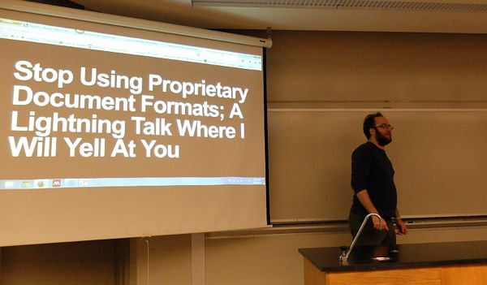
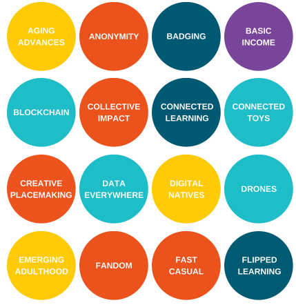
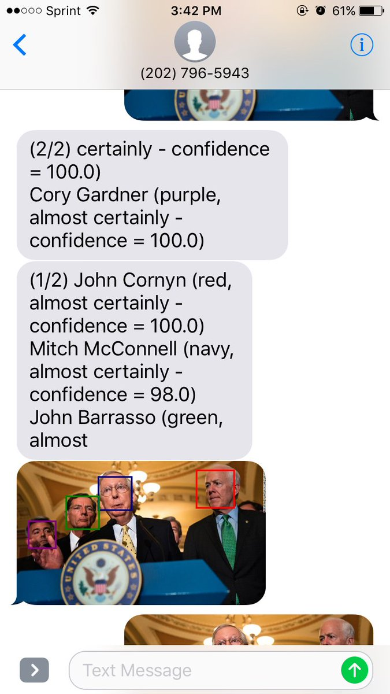
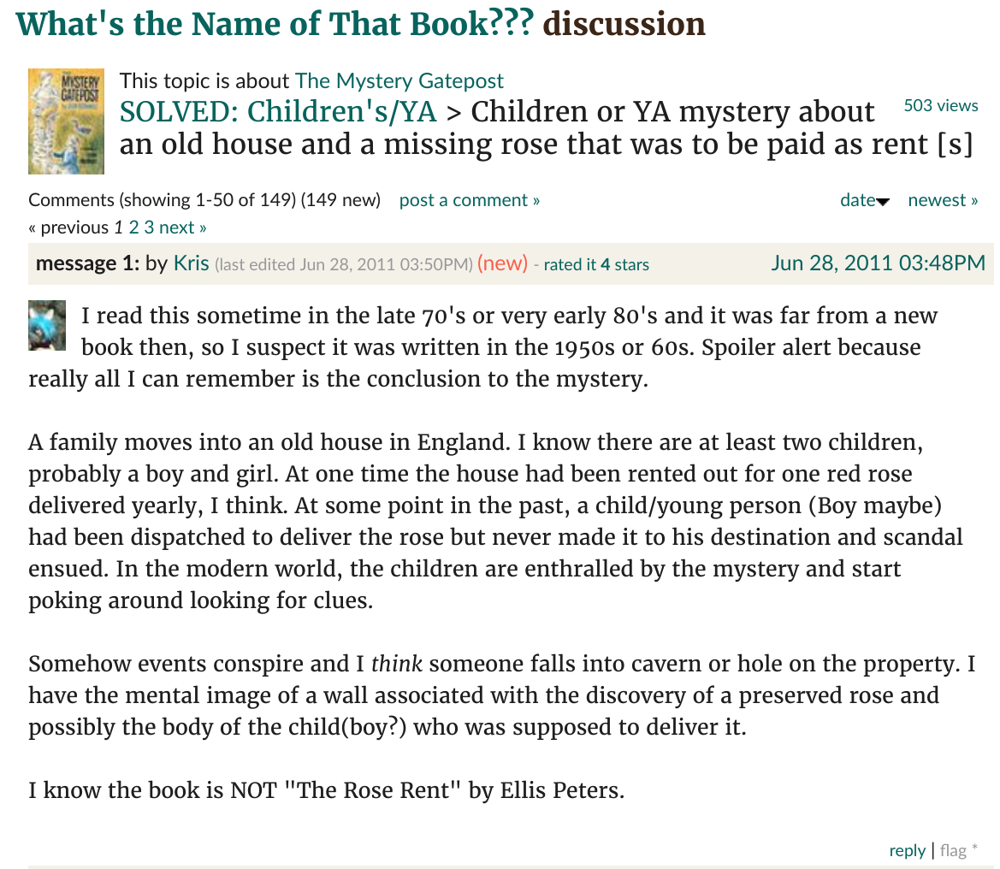

% The Present and Future of Services 2
% Peter Organisciak
% Fall 2018

## Today

- Presentation
- Lab discussion
- The Present and Future of Services - Part 2

------

{height=600px}

-----

## Administration

- Marketing grade location
- Course evaluations

------

{class="plain"}

-------

## Announcements

- Apologies: no Kiki or Brady Bunch intro!
- Hiring - Massive Texts Lab

------------

# Digital Preservation

-------

### Data curation in Academic Libraries

-----

----

- Research Data Services
    - support, expertise
    - technical resources
- Institutional Repositories
    - 1st party hosting for scholarly research

----------

- Adapting to space changes as more materials go digital  - thinking about hardware - studios, makerspaces, digitization stations, wifi hotspots, tool libraries
- Community gardens, coffee shops, art galleries
- Social workers - libraries as safe civic spaces for all
- Filling in for struggling institutions; e.g. schools
- Augmented reality for imaginary spaces 
- Repair Cafes - working against modern disposable culture
- Patron-based automatic recommendation
- Digital literacy and empowerment centers, spaces for social discourse

---------

- Offline library services - device free zones, digital escape spaces, and board game nights
- Loosening of geographic boundaries
- Visual literacy in libraries
- Corrections for income inequality - overhauling fine system, targeting markerspaces (Matt, Rob)
- Digital materials: may improve access for users that cannot make it to the library, but also advantages people who have the hardware to access it
- Deprofessionalization concerns

----------

- "third place" - libraries as a third place for learning beyond school and home
- "Adultology" - Boulder class
- mobile hotspots (rural), crafting space, robotics, cooking clubs
studio space
- casual and welcoming community spaces
- Gaming (Fortnight, Minecraft)
- VR - visiting dead or imaginary spaces
- Technology branches
- Elderly population and lower-income users will be left behind by reliance on digital technologies
- Smart Cities - data-driven governance
- Noise may deter some patrons
- Ubiquitous Wifi access

-------------

# Trends

- Trends - Center for the Future of Libraries

-----

## Face Recognition, voice control, and VR

How may libraries make use of new tech?

- What are the potential uses in libraries?
- What are the risks?

----------

{height=400px}

NYT tool for recognizing members of Congress. Can this be applied to archives?

----

Talks about NYPL's "Title Quest" hackathons

-----

{height=500px}
[GoodReads - What's the Name of that Book???](https://www.goodreads.com/group/show/185-what-s-the-name-of-that-book)
- Also: [Reddit: /r/whatsthatbook](https://www.reddit.com/r/whatsthatbook/)

-----

Computer Vision - Search By Cover Text

-----

Large Digital Libraries - Search by text inside

- HathiTrust Digital Library
- Internet Archive
- Google Books

-----

## Better living through hardware

Drones, robots, 3d printing, connected toys, internet of things, haptics, makerspaces

>- _Generously: how can these be useful?_
>- _What counterpoints are there? What risks do they pose?_

------

>- cost of ephemeral fads
>- haptics can help in learning
>- overly structured toys limit learning through play 
>- demographics: tech may need to fill in as working/retired ratio shifts

-------

## Copyright

------

## Information in Society

Library and Information Science skills are pertinent in many ways beyond the library:
can librarian expertise exist beyond libraries?

>- How do people find information?
>- How are our information systems biased, and how do we fix them?
>- How do we organize and preserve the massive quantities of data that we have?

------

## The Future

- _Why_ do libraries change?
    - Why space evolution? Why makerspaces? Why e-books?

--------

### Licklider - Libraries of the Future

- dwindling physical storage needs
- knowledge graphs: information needs to be structured to be convenient
    - the dream of Linked Open Data and relationship graphs
- interdisciplinary boundaries: there's value in computer sciences, social sciences, library sciences
- we need a 'relevance network'
    - anticipates branches of relevance, and information retrieval ranking (think PageRank!)

----

- imagined 'pro-cognitive' systems - systems that augment your thinking
    - natural language interactions
        - user-based rather than system-based questions, on a system! (sorta...)
- techno-optimism, but imagining the future around _needs_, not _haves_

------

## Overview

- Instruction and Reference
- Impact Assessment and Needs Assessment
- Outreach and Marketing
- Information Behavior, User Needs
- Services for different populations, different needs

------

- Libraries as information organizations must evolve to meet information needs
- Libraries as community and civic spaces must understand their users closely and how their service needs manifest in ways different than 'status quo' service needs

------

## Social-optimized information services

- Information ethics, algorithmic ethics
- Universal access

What do you optimize on?

Is it providing a good service?
Is it making money?
Is it collecting users?
Is it in correcting wrongs and amplifying rights?

How we set our targets changes what we give back to the world.
Tech companies optimize for a mix of goals, but is it the mix that the world needs? Right now we're ceding the society to tech companies and their goals. Sometimes these are great, and silicon valley is not a net evil. However, when the goals don't align with societal good, they'll sometimes stray from outcomes that are not in the best interest of society.

- Internet connecting toys that don't protect our children's privacy
- Amazon using face recognition to identify potential criminals, and finding that it predominantly leads to black false positive.
- Sentiment models that somehow assign a negative valence to traditional black names 
- News feeds that burrow you in safe bubbles and prioritize outrageous assertions over honest ones, slowly moving your bubble toward extremism

Let's not get into self-indulgent backpatting - this isn't who we are, this is what we could be and who we should aspire to be.

Libraries are institutions dedicated to supporting honest and universal access to information. We should understand how data and information exists in society, but we should also *act* to correct when it's being misappropriated and perverted by unrepresentative goals.

-------

# Thank you!
