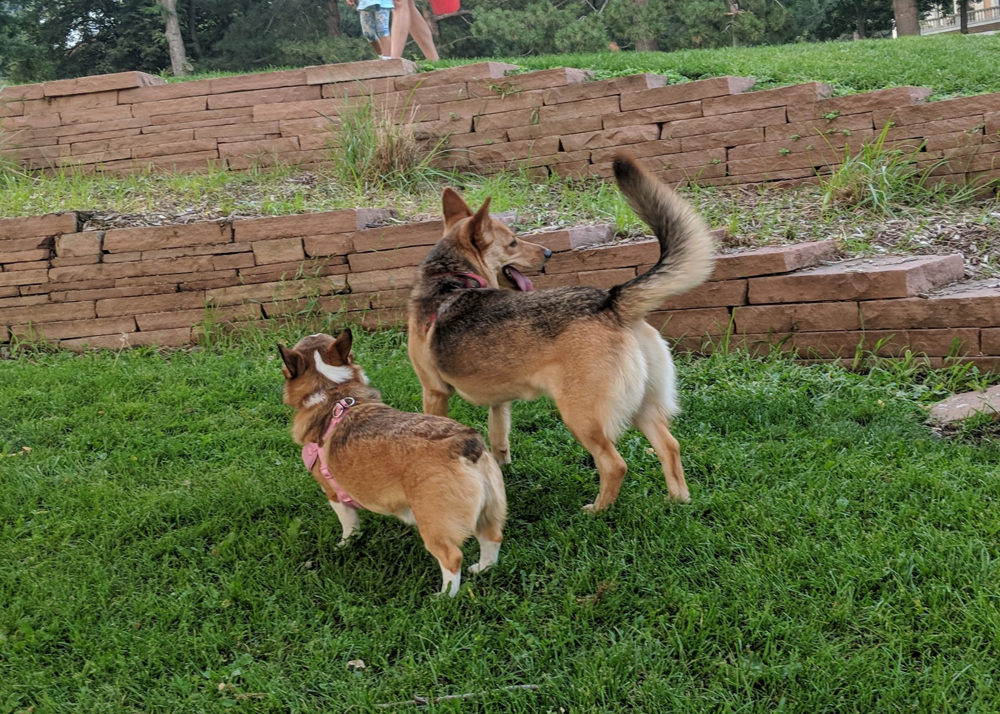

% Shushing 101
% Peter Organisciak
% Fall 2018

# User and Access Services

# Today

Welcome!

- Course Overview
- About Me
- Administration
- About you
- Tips
- Introduction to Library Services

----

# Announcements

- CALCON

----

----

### Course Overview

> "The library is a distinctly social phenomenon and as such is susceptible to all the influences that react upon our social structure." - Jesse Shera, 1933

----

This course is about libraries as service providers, and the relationships of those services to users.

We're looking at _roles_ and _needs_

----

{class="plain"}

Easy enough...

-----

.. but what happens as user needs shift?

{class="plain"}

----

{class="plain"}

----

Think of _User and Access Services_ as the first part of a two-year class.

We're establishing the foundation to build on through your MLIS.

---------

### Topics

>- Instruction
>- Information behavior
>- Information literacy
>- Outreach
>- Assessment, evaluation
>- Circulation
>- Library as space
>- Serving different population groups
>- Changing environments and services

-----

# Administration

-----

## Office Hours

Book at [https://organisciak.youcanbook.me](https://organisciak.youcanbook.me)

Generally: Wed 11-1, with other times added when possible

------

# Communication policy

1. Is it a question that might interest other students? Post it on Canvas!

2. Is it a question that only pertains to you? Email Dr. O, with [LIS4015] at the start of subject line. This helps ensure a quicker response.

-----

## Tips for graduate school

>- Work together to figure things out.
Refer to the readings and class materials in assignments.
>- Write clearly and succinctly. This is a professional program and you should be writing as people read. Don't try to impress, try to communicate.
>- Engage with the content earnestly. Appreciate the breadth of the challenges and consider how the solutions address or fail to address them. What’s interesting or unexpected? What open threads are exciting to pursue further?

------

## Expectations in graduate school

You are expected to be more self-driven and creative with your assignments in graduate school. Assignments are not checklists of instructions to follow - they are prompts for you to mix with your learned and experienced knowledge.

------

## About Me

-----

### About you

Learn something about your partner and tell the rest of the class.

- What are your career goals? What's an interesting thing about yourself? Do you have pets? What do you do in your free time? What's your first language? Why University of Denver? Why LIS? What's your least favorite thing about school? Do you like or hate _Inception_?

------

- Syllabus Overview
- Reserves
- Assignments
- Canvas
  - reading schedule
- Labs

-----

### Group Preference

- Type of library or archive
- Age group
- Name, section

-----

# BREAK

Let's take a break.

_If you have a computer, now's a good time for the two optional surveys: one on your preference of target group for the marketing proposal, and one allowing you to volunteer for the earlier deadline for the Information Literacy Instruction assignment._

----

# Introduction

----

### Broad Library Types

>- Public
>- Academic
>- Corporate / Private
>- School
>- Special

----

Some ways to think about libraries - by its materials, by its services, by it's profession, by its users, and by its spaces...

-----

### Four Basic Roles of Libraries

>1. _Acquiring_ materials deemed valuable or useful
>2. _Storing_ and _preserving_ those materials
>3. _Organizing_ materials for efficient access
>4. _Providing assistance_ to individuals in locating information

Evans (p.5)

>- _In this class, we look at access (3) and services (4)_

----

### ALA Code of Ethics

<http://www.ala.org/tools/ethics>

------

# Users

-----

### Who does the library serve?

>- Patron?
>- Client?
>- Customer?
>- User?
>- Guest?

----

"Librarians who flinch at the word _customer_ are operating out of an outmoded paradigm. This older paradigm portrays the library as a "public good" with as high a ranking on the 'goodness' scale as the national flag, parenthood, and apple pie. However... unless it adopts and masters the language and techniques of its competitors, it faces a future of declining support and significance.""

 - Darlene Weingand, _Customer service excellence : a concise guide for librarians_, 1997

-----

>- Do you agree? Disagree?
>- Even if _customer_ feels icky... what would the _customer service_ lens entail?

------

- Thinking beyond service _offerings_ - including _quality_ and _satisfaction_
- Assessment - surveys, interviews
- Understanding the user, listening and responding
- Setting expectations
- avoiding unhappy users
- emphasizing communication in librarianship > dealing with people is central!

Evans

------

### Types of Needs

>- _Normative_ needs - those based on expert opinion
>- _Felt_ needs - community reactions to a problem or issue
>- _Expressed_ needs - actionable beliefs - what users *do* rather than *say*
>- _Comparative_ needs - those that noted relative to similar institutions and communities

----

_Normative, felt, expressed, or comparative?_

- Noting a dearth of space for patrons with laptops, a library moves less popular books off-site to add community space.
- Seeing the growth of makerspaces as a service in larger communities, a library budgets to add their own.
- A study finds that children participating in after-school reading programs score better in literacy testing.
- A library in a largely Chinese community hires more Mandarin-speaking librarians.

----

Not all needs can be addressed, and some conflict with each other.

Why?

>- budget issues
>- time, space
>- The values of experts and communities may misalign

------

# Library Spaces

----

## Library Experiences

Who has been to Anderson Academic Commons?

-----

>physical library 'is a place where cultural, social, and intellectual exchanges occur, often mediated by the resources in the library collection'

- Mardis 2011

----

[A search for 'library spaces'](https://www.google.com/search?q=library+spaces&rlz=1C1GGRV_enUS761US761&tbm=isch&tbo=u&source=univ&sa=X&ved=0ahUKEwj6ifbfkqDWAhVh1oMKHermCCMQsAQIdQ)

----

Are libraries for books, or for people?

>- Librarians disagree
>- Patrons disagree

----

------

### Multiple Spaces, aka the _Death of Shushing_

Libraries, especially public libraries, are increasingly trying to design around multiple spaces and multiple uses.

----

What spaces do we usually see in a public library?

>- Quiet, loud
>- media spaces
>- children's reading spaces
>- toddler, baby, family activity areas
>- multimedia, gaming
>- computer labs
>- book club, meeting spaces
>- book stores
>- music areas
>- archives
>- display areas

------

[Auraria Public Library Spaces](https://library.auraria.edu/about/spaces)

------

- [Denver ideaLAB](https://www.denverlibrary.org/meeting-rooms-branches)
- [BLDG 61: Boulder Library Makerspace](https://boulderlibrary.org/bldg61/)
- [MakeLab Auraria](https://library.auraria.edu/makelab)

-----

[Children's Activity and Learning Center, Thailand](https://www.designboom.com/architecture/24h-architecture-childrens-activity-and-learning-center-thailand/)

-----

Temporary Tree House Gallery in Regent's Park

----

- [How do Americans use Libraries](http://www.pewinternet.org/2016/09/09/libraries-2016/)
- [ALA Public Library Factsheet](http://www.ala.org/tools/libfactsheets/alalibraryfactsheet06)
-------

# Next Week

- Two optional preference surveys, on Canvas.
    - Topics for marketing proposal group project
    - Volunteer for week 6 deadline for information literacy instruction assignment

- Lab #1 discussion, on Canvas

- Post on the _Introductions_ forum
    - _Introduce myself again?_ - This is for the benefit of myself and your classmates - we can refer back to it. This is optional, but is _one_ way to contribute toward your participation grade
-----
% Information Behavior
% Peter Organisciak
% Fall 2018

# Administration

## Schedule
- Wrap up introduction
- Groups for assignment #3
- Intro to bibliographies
- Instruction schedules
- Lab reading assignment
- Information seeking behavior

-------

## Announcements?

--------

### Kiki Watch

--------

## Groups

------

## Annotated bibliography

- A list of citations to materials accompanied by a short annotation
    - [How to prepare an annotated bibliography](http://guides.library.cornell.edu/annotatedbibliography) - Michael Engle, Cornell University library
- 2 pages, 10-15 citations
- Look ahead to Lab #3 in deciding on a group

------

>- Literature review vs. annotated bibliography
>- 	

------

Next week's lab: Types of Libraries

------

## Introductions post

--------

# Information behavior

>- "the totality of human behavior in relation to sources and channels of information, including both active and passive information-seeking and information use" - Wilson 1999

-------

- Today's class is likely the most theoretical in this quarter
  - Consider these models throughout the course

----

How do you seek information?

Examples of your information needs

-----

- Sense-Making - Dervin
- Anomalous States of Knowledge - Belkin
- Wilson's General Models
- Ellis' Model of Information Behavior
- Berry-Picking - Bates
- Communities of Practice - Davies
- Information Search Process - Kuhlthau

--------------

## Ellis model

_Starting - Chaining - Browsing - Differentiating - Monitoring - Extracting - Verifying - Ending_

>- _starting_: beginning activities, e.g. asking some knowledgeable colleague
>- _chaining_: following footnotes and citations or
‘forward’ chaining through citation indexes
>- _browsing_: semi-directed or semi-structured searching
>- _differentiating_: using differences in information sources as a way of filtering for useful information

-------

## Ellis model

_Starting - Chaining - Browsing - Differentiating - Monitoring - Extracting - Verifying - Ending_

>- _monitoring_: keeping up-to-date
>- _extracting_: selectively identifying relevant material
>- _verifying_: checking information accuracy
>- _ending_: 'tying up loose ends'

-------

{class="plain"}

-------

## Chaining

- [Forward chaining on Google Scholar](https://scholar.google.com/scholar?q=wilson+information+behavior)

--------

## Bates (1989) - Berry-picking

-------

{class='plain'}

-------

{class='plain'}

-------

{class='plain'}

--------

Bates lists six more strategies for information-seeking:

- footnote chasing (Ellis' "backward chaining")
- Citation search (Ellis's "forward chaining")
- journal run
- area scanning (what's in the library next to the book you want?)
- subject searches in bibliographies and abstracting services
- author searching

-------

{class="plain"}

-------

{class="plain"}

-------

- What types of passive search or ongoing search do you perform? In what way?

-------

## Kuhlthau's Information Search Process (ISP)

- alternate conceptual framework to Ellis, more experiential
- focus on active search
- considers thoughts, feelings, and actions

-------

- _Initiation_ - person realizes a lack of knowledge or understanding
- _Selection_ - a general area or problem is identified
- _Exploration_ - a survey of material, which can be intimidating or incompatible
- _Formulation_ - focusing your search
- _Collection_ - gathering relevant information
- _Presentation_ - putting the learning to use

-------

**Feelings**

- _Initiation_ - uncertainty
- _Selection_ - optimism
- _Exploration_ - confusion, frustration, doubt
- _Formulation_ - clarity
- _Collection_ - sense of direction/confidence
- _Presentation_ - relief (then satisfaction or dissatisfaction as you start to use the information)

-------

- Do you agree with this process? These emotions?
- Have you recently experienced confusion or frustration during the exploration step?
- Is this useful? How might we apply this framework?

-------

## Dervin - Sense-Making

> "information-seeking and information-using occur when individuals find themselves unable to progress through a particular situation without forming some kind of new "sense" about something" (Dervin 86)

------------

## Dervin - Sense-Making

- Associated with shift from information _sources_ to _users_
- considers _cognitive gap_
- used in reference interview techniques (describing situation-gaps-uses)
- focus on verbs rather than nouns, emphasizing the process
- Information as a product of human observation, colored by situation and experience

-------

## situation-gaps-uses models

- situation refers to events that contextualize the lack of sense - or gap
- use is the purpose of the answer

'sense-making' is intended to rebut 'information-seeking'

-------

## Sense-unmaking

 If information is a product of human situation and experience, it is important to be able to deconstruct it and reconstruct it in new contexts. Power plays into sense-making, and recognizing it provides a way to adapt to that

-------

## Belkin (1980) - Anomalous Ways of Knowing

- anomaly between the person's knowledge and their ability to achieve some goals
- explicit about _cognitive viewpoint_: "processing of information, whether perceptual or symbolic, is mediated by a system"
- Anomalous state exists between different mediated states of knowledge

-------

{class='plain'}

---------------

- Cognitive dimensions: Belkin (ASK), Dervin (Sense-Making)
- Emotional dimensions: Kuhlthau
- Information seeking process: Bates (Berry-picking)
- User and information context: Wilson, Belkin, Dervin

---------------

## Why does this matter?

>- assist in reference interview
>- positioning user, context, and emotional into instruction
>- expanding thinking about possible approaches (e.g. chaining, monitoring, passive search)

----------

# For Next week

- Lab #2 will be in class. Read your reading!
-----
