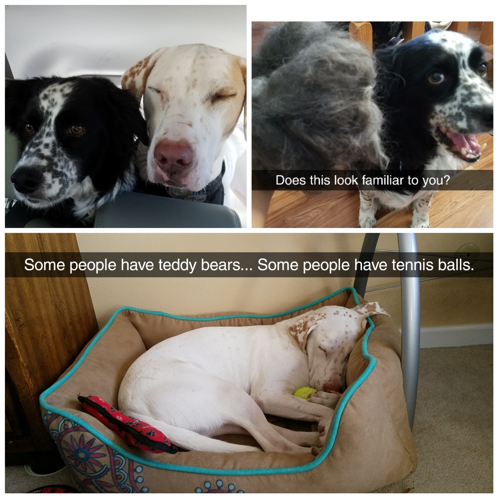
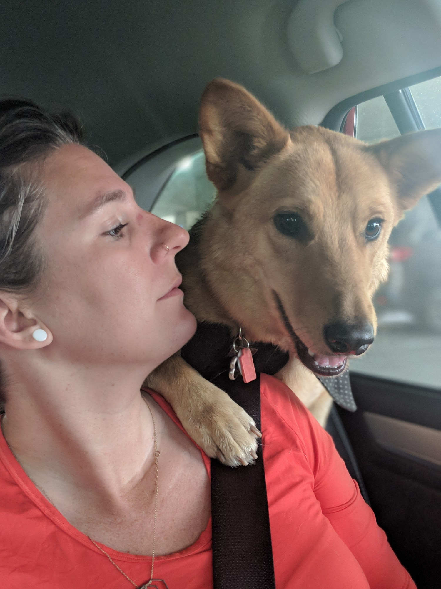
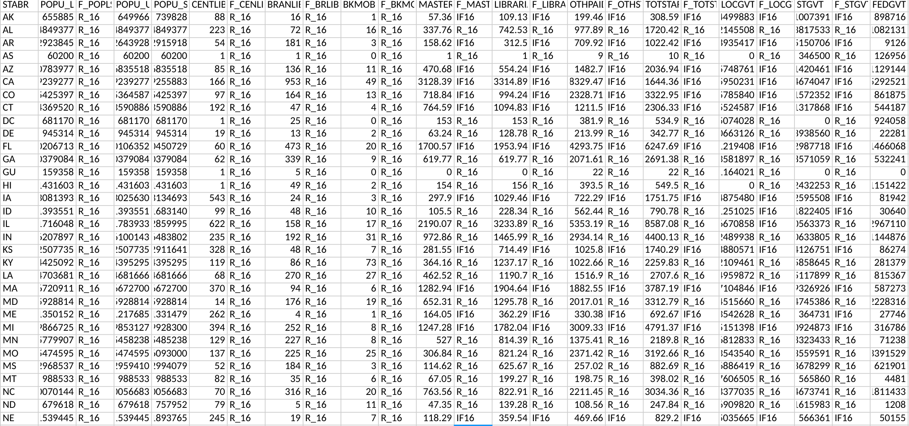
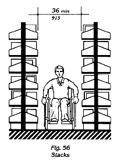
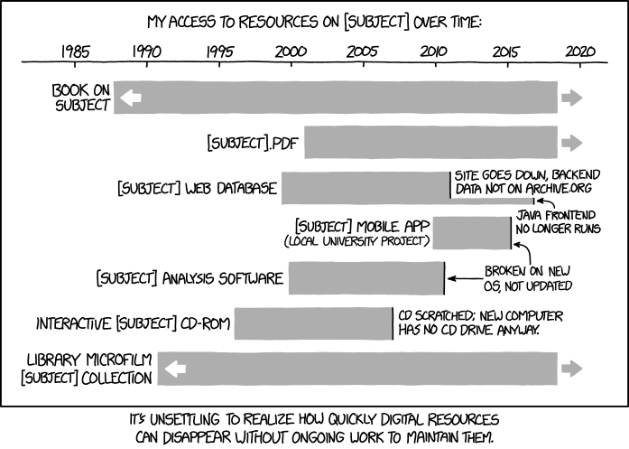
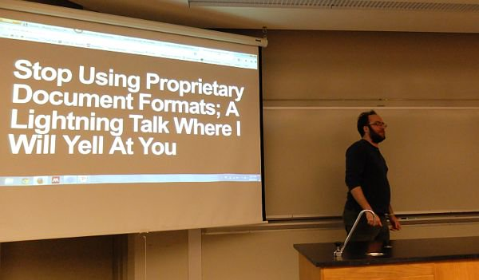

% Shushing 101
% Peter Organisciak
% Fall 2018

# User and Access Services

# Today

Welcome!

- Course Overview
- About Me
- Administration
- About you
- Tips
- Introduction to Library Services

----

# Announcements

- CALCON

----

----

### Course Overview

> "The library is a distinctly social phenomenon and as such is susceptible to all the influences that react upon our social structure." - Jesse Shera, 1933

----

This course is about libraries as service providers, and the relationships of those services to users.

We're looking at _roles_ and _needs_

----

{class="plain"}

Easy enough...

-----

.. but what happens as user needs shift?

{class="plain"}

----

{class="plain"}

----

Think of _User and Access Services_ as the first part of a two-year class.

We're establishing the foundation to build on through your MLIS.

---------

### Topics

>- Instruction
>- Information behavior
>- Information literacy
>- Outreach
>- Assessment, evaluation
>- Circulation
>- Library as space
>- Serving different population groups
>- Changing environments and services

-----

# Administration

-----

## Office Hours

Book at [https://organisciak.youcanbook.me](https://organisciak.youcanbook.me)

Generally: Wed 11-1, with other times added when possible

------

# Communication policy

1. Is it a question that might interest other students? Post it on Canvas!

2. Is it a question that only pertains to you? Email Dr. O, with [LIS4015] at the start of subject line. This helps ensure a quicker response.

-----

## Tips for graduate school

>- Work together to figure things out.
Refer to the readings and class materials in assignments.
>- Write clearly and succinctly. This is a professional program and you should be writing as people read. Don't try to impress, try to communicate.
>- Engage with the content earnestly. Appreciate the breadth of the challenges and consider how the solutions address or fail to address them. What’s interesting or unexpected? What open threads are exciting to pursue further?

------

## Expectations in graduate school

You are expected to be more self-driven and creative with your assignments in graduate school. Assignments are not checklists of instructions to follow - they are prompts for you to mix with your learned and experienced knowledge.

------

## About Me

-----

### About you

Learn something about your partner and tell the rest of the class.

- What are your career goals? What's an interesting thing about yourself? Do you have pets? What do you do in your free time? What's your first language? Why University of Denver? Why LIS? What's your least favorite thing about school? Do you like or hate _Inception_?

------

- Syllabus Overview
- Reserves
- Assignments
- Canvas
  - reading schedule
- Labs

-----

### Group Preference

- Type of library or archive
- Age group
- Name, section

-----

# BREAK

Let's take a break.

_If you have a computer, now's a good time for the two optional surveys: one on your preference of target group for the marketing proposal, and one allowing you to volunteer for the earlier deadline for the Information Literacy Instruction assignment._

----

# Introduction

----

### Broad Library Types

>- Public
>- Academic
>- Corporate / Private
>- School
>- Special

----

Some ways to think about libraries - by its materials, by its services, by it's profession, by its users, and by its spaces...

-----

### Four Basic Roles of Libraries

>1. _Acquiring_ materials deemed valuable or useful
>2. _Storing_ and _preserving_ those materials
>3. _Organizing_ materials for efficient access
>4. _Providing assistance_ to individuals in locating information

Evans (p.5)

>- _In this class, we look at access (3) and services (4)_

----

### ALA Code of Ethics

<http://www.ala.org/tools/ethics>

------

# Users

-----

### Who does the library serve?

>- Patron?
>- Client?
>- Customer?
>- User?
>- Guest?

----

"Librarians who flinch at the word _customer_ are operating out of an outmoded paradigm. This older paradigm portrays the library as a "public good" with as high a ranking on the 'goodness' scale as the national flag, parenthood, and apple pie. However... unless it adopts and masters the language and techniques of its competitors, it faces a future of declining support and significance.""

 - Darlene Weingand, _Customer service excellence : a concise guide for librarians_, 1997

-----

>- Do you agree? Disagree?
>- Even if _customer_ feels icky... what would the _customer service_ lens entail?

------

- Thinking beyond service _offerings_ - including _quality_ and _satisfaction_
- Assessment - surveys, interviews
- Understanding the user, listening and responding
- Setting expectations
- avoiding unhappy users
- emphasizing communication in librarianship > dealing with people is central!

Evans

------

### Types of Needs

>- _Normative_ needs - those based on expert opinion
>- _Felt_ needs - community reactions to a problem or issue
>- _Expressed_ needs - actionable beliefs - what users *do* rather than *say*
>- _Comparative_ needs - those that noted relative to similar institutions and communities

----

_Normative, felt, expressed, or comparative?_

- Noting a dearth of space for patrons with laptops, a library moves less popular books off-site to add community space.
- Seeing the growth of makerspaces as a service in larger communities, a library budgets to add their own.
- A study finds that children participating in after-school reading programs score better in literacy testing.
- A library in a largely Chinese community hires more Mandarin-speaking librarians.

----

Not all needs can be addressed, and some conflict with each other.

Why?

>- budget issues
>- time, space
>- The values of experts and communities may misalign

------

# Library Spaces

----

## Library Experiences

Who has been to Anderson Academic Commons?

-----

>physical library 'is a place where cultural, social, and intellectual exchanges occur, often mediated by the resources in the library collection'

- Mardis 2011

----

[A search for 'library spaces'](https://www.google.com/search?q=library+spaces&rlz=1C1GGRV_enUS761US761&tbm=isch&tbo=u&source=univ&sa=X&ved=0ahUKEwj6ifbfkqDWAhVh1oMKHermCCMQsAQIdQ)

----

Are libraries for books, or for people?

>- Librarians disagree
>- Patrons disagree

----

------

### Multiple Spaces, aka the _Death of Shushing_

Libraries, especially public libraries, are increasingly trying to design around multiple spaces and multiple uses.

----

What spaces do we usually see in a public library?

>- Quiet, loud
>- media spaces
>- children's reading spaces
>- toddler, baby, family activity areas
>- multimedia, gaming
>- computer labs
>- book club, meeting spaces
>- book stores
>- music areas
>- archives
>- display areas

------

[Auraria Public Library Spaces](https://library.auraria.edu/about/spaces)

------

- [Denver ideaLAB](https://www.denverlibrary.org/meeting-rooms-branches)
- [BLDG 61: Boulder Library Makerspace](https://boulderlibrary.org/bldg61/)
- [MakeLab Auraria](https://library.auraria.edu/makelab)

-----

[Children's Activity and Learning Center, Thailand](https://www.designboom.com/architecture/24h-architecture-childrens-activity-and-learning-center-thailand/)

-----

Temporary Tree House Gallery in Regent's Park

----

- [How do Americans use Libraries](http://www.pewinternet.org/2016/09/09/libraries-2016/)
- [ALA Public Library Factsheet](http://www.ala.org/tools/libfactsheets/alalibraryfactsheet06)
-------

# Next Week

- Two optional preference surveys, on Canvas.
    - Topics for marketing proposal group project
    - Volunteer for week 6 deadline for information literacy instruction assignment

- Lab #1 discussion, on Canvas

- Post on the _Introductions_ forum
    - _Introduce myself again?_ - This is for the benefit of myself and your classmates - we can refer back to it. This is optional, but is _one_ way to contribute toward your participation grade
-----
% Information Behavior
% Peter Organisciak
% Fall 2018

# Administration

## Schedule
- Wrap up introduction
- Groups for assignment #3
- Intro to bibliographies
- Instruction schedules
- Lab reading assignment
- Information seeking behavior

-------

## Announcements?

>- Showcase of Opportunities - this Friday
>- Student group officer positions
>- Digital Scholarship in the Front Range - [Sept 25 Meetup](https://digitalfrontrange.wordpress.com/sept-25-meet-up-cu-denver/)
    >- Dr. O shared the link to the mailing list on Libschool
>- Robert McDonald, Dean of CU Libraries, Oct 26th - 2:00pm
>- RMIS writing group - Every Wednesday 1-4
>- RMIS Slack - [https://rmis-du.slack.com](https://rmis-du.slack.com)
>- Philosophy Discussion Group

--------

### Kiki Watch

--------

## Groups

------

## Annotated bibliography

- A list of citations to materials accompanied by a short annotation
    - [How to prepare an annotated bibliography](http://guides.library.cornell.edu/annotatedbibliography) - Michael Engle, Cornell University library
- 2 pages, 10-15 citations
- Look ahead to Lab #3 in deciding on a group

------

>- Literature review vs. annotated bibliography
>- APA Style
>- Finding readings
>- Accessing readings
>- Citation management

------

Next week's lab: Types of Libraries

------

## Introductions post

--------

# Information behavior

>- "the totality of human behavior in relation to sources and channels of information, including both active and passive information-seeking and information use" - Wilson 1999

-------

- Today's class is likely the most theoretical in this quarter
  - Consider these models throughout the course

----

How do you seek information?

Examples of your information needs

-----

- Sense-Making - Dervin
- Anomalous States of Knowledge - Belkin
- Wilson's General Models
- Ellis' Model of Information Behavior
- Berry-Picking - Bates
- Communities of Practice - Davies
- Information Search Process - Kuhlthau

--------------

## Ellis model

_Starting - Chaining - Browsing - Differentiating - Monitoring - Extracting - Verifying - Ending_

>- _starting_: beginning activities, e.g. asking some knowledgeable colleague
>- _chaining_: following footnotes and citations or
‘forward’ chaining through citation indexes
>- _browsing_: semi-directed or semi-structured searching
>- _differentiating_: using differences in information sources as a way of filtering for useful information

-------

## Ellis model

_Starting - Chaining - Browsing - Differentiating - Monitoring - Extracting - Verifying - Ending_

>- _monitoring_: keeping up-to-date
>- _extracting_: selectively identifying relevant material
>- _verifying_: checking information accuracy
>- _ending_: 'tying up loose ends'

-------

{class="plain"}

-------

## Chaining

- [Forward chaining on Google Scholar](https://scholar.google.com/scholar?q=wilson+information+behavior)

--------

## Bates (1989) - Berry-picking

-------

{class='plain'}

-------

{class='plain'}

-------

{class='plain'}

--------

Bates lists six more strategies for information-seeking:

- footnote chasing (Ellis' "backward chaining")
- Citation search (Ellis's "forward chaining")
- journal run
- area scanning (what's in the library next to the book you want?)
- subject searches in bibliographies and abstracting services
- author searching

-------

{class="plain"}

-------

{class="plain"}

-------

In small groups:

- What types of passive search or ongoing search do you perform? In what way?
- What are we still missing from here?

-------

## Kuhlthau's Information Search Process (ISP)

- alternate conceptual framework to Ellis, more experiential
- focus on active search
- considers thoughts, feelings, and actions

-------

- _Initiation_ - person realizes a lack of knowledge or understanding
- _Selection_ - a general area or problem is identified
- _Exploration_ - a survey of material, which can be intimidating or incompatible
- _Formulation_ - focusing your search
- _Collection_ - gathering relevant information
- _Presentation_ - putting the learning to use

-------

**Feelings**

- _Initiation_ - uncertainty
- _Selection_ - optimism
- _Exploration_ - confusion, frustration, doubt
- _Formulation_ - clarity
- _Collection_ - sense of direction/confidence
- _Presentation_ - relief (then satisfaction or dissatisfaction as you start to use the information)

-------

In small groups:

- Do you agree with this process? These emotions?
- Have you recently experienced confusion or frustration during the exploration step?
- Is this useful? How might we apply this framework?

-------

## Dervin - Sense-Making

> "information-seeking and information-using occur when individuals find themselves unable to progress through a particular situation without forming some kind of new "sense" about something" (Dervin 86)

------------

## Dervin - Sense-Making

- Associated with shift from information _sources_ to _users_
- considers _cognitive gap_
- used in reference interview techniques (describing situation-gaps-uses)
- focus on verbs rather than nouns, emphasizing the process
- Information as a product of human observation, colored by situation and experience

-------

## situation-gaps-uses models

- situation refers to events that contextualize the lack of sense - or gap
- use is the purpose of the answer

'sense-making' is intended to rebut 'information-seeking'

-------

## Sense-unmaking

 If information is a product of human situation and experience, it is important to be able to deconstruct it and reconstruct it in new contexts. Power plays into sense-making, and recognizing it provides a way to adapt to that

-------

## Belkin (1980) - Anomalous Ways of Knowing

- anomaly between the person's knowledge and their ability to achieve some goals
- explicit about _cognitive viewpoint_: "processing of information, whether perceptual or symbolic, is mediated by a system"
- Anomalous state exists between different mediated states of knowledge

-------

{class='plain'}

---------------

- Cognitive dimensions: Belkin (ASK), Dervin (Sense-Making)
- Emotional dimensions: Kuhlthau
- Information seeking process: Bates (Berry-picking)
- User and information context: Wilson, Belkin, Dervin

---------------

## Why does this matter?

>- assist in reference interview
>- positioning user, context, and emotional into instruction
>- expanding thinking about possible approaches (e.g. chaining, monitoring, passive search)

----------

# Group Time

----------

# One-Minute Paper

----------

# For Next week

- Lab #2 will be in class. Read your reading!
-----
% Information services
% Peter Organisciak
% Fall 2018

# Administration

>- Did everybody access the readings okay?
>- Field trip
>- Cool stuff?

------

## Announcements?

- Philosophy mini-course from Jordan
- Online class
- Crimson Classic - 2.6mi run, next Thursday at 3
- [Denver Startup Week](https://www.denverstartupweek.org/)

------

## Kiki Watch

-----

## Pet Pics

{ height=500px }

Hadley

-----

## Lab \#3

-----

# Last Week wrap up

------

# Access Services

Traditional library roles - connecting people to materials

- circulation
- interlibrary loan
- signage
- shelving

-----

## Technical services

The beyond the desk work to improve access to materials; e.g. acquisitions, subscriptions

- Acquisitions
- Cataloguing
- Classification
- Subject access
- Authority control and linked open data
- Metadata standards

------

_What types of materials or documents do libraries provide access to?_

-----

## Acquisitions

- Moving to subscriptions and consortial access

- Varies greatly by library types
  - special libraries: going deep in a narrow area
  - academic libraries: monographs, serials / journals, faculty requests

------

## Acquisitions

- bibliographer recommendations
- trade publications
- working with intermediary vendors (Baker and Taylor, YBP, Blackwell)
    - library specifies material needs, and vendor automatically buys and ships materials

- Acquisitions Librarian - de-professionalizing (Helfer and Heinrich 2010)

------

## Interlibrary Loan

- Service for requesting materials from other libraries
- Expands the effective size of collection that a user has access to
- started early 20th century and grew in the ensuing decades

----

What are the problems with ILL?

>- For users
>     - speed and time
>     - occasional cost-sharing (e.g. photocopying)
>     - effort requesting
>- For libraries
>     - significant cost and effort
>          - Evans et al quote two libraries at \$28 and \$45/book

------

## Effort for ILL

- hardware/software, licensing
- record-keeping, planning (working with materials beyond your regular system)
- searching, picking, shipping

-----

## On-demand materials

>- Document delivery: order materials for a fee - digitized or shipped
>     - Sometimes delivered straight to users, particularly for special circumstances (e.g. rural patrons) or special materials (e.g. Braille books)
>- Twist on ILL: centralized sharing facilities
>- User-request acquisitions
>- Reciprocal borrowing: allowing members to 'cross' lines
>     - _When would this be useful? What types of libraries?_

------

_We'll return to technical services shortly. However, let's consider different types of libraries and library needs first._

-----

# Types of Libraries

-----

- What is distinct about your type of library?
- Who does your library serve? What roles do librarians play?
- What types of libraries are similar?
- Can you think of examples of the library? How you been to one?
- How common is your library?
- Who funds the library type?
- What facts surprised you from the reading? What outstanding questions does the article not answer?

-------

# Technical Services - cont.

----

## Cataloguing

- describing materials for collection access, after acquisition

- Guidelines:
   - Anglo-American Cataloging Rules (AACR) - 1967, AACR2 1988
   - Resource Description and Access (RDA)

------

- original cataloguing: creating a record from scratch
- copy cataloguing: starting with information from elsewhere

--------

# Vocabulary

From ODLIS (Online Dictionary of Library and Information Science):

-_bibliographic record_
An entry representing a specific item in a library catalog or bibliographic database, containing all the data elements necessary for a full description, presented in a specific bibliographic format.

-----

- Metadata: data about data (information about something)
- ODLIS: "Structured information describing information resources/objects for a variety of purposes."

--------

- three parts to cataloguing record: description, subject access and classification, and authority control

--------

## Subject access and classification

- subject analysis: what are the materials about?
  - uses a controlled vocabulary, like Library of Congress Subject Headings (LCSH), and Medical Subject Headings (MeSH)

- classification: assigning a call number in a classification scheme, like Library of Congress (LCC), Dewey Decimal (DDC), or Universal Decimal System (UDC)

------

## Library of Congress Subject Headings (LCSH)

<http://authorities.loc.gov/cgi-bin/Pwebrecon.cgi?DB=local&PAGE=First>

LCSH and LCC in context: [LOC online catalog](https://catalog.loc.gov/)

----------

## Authority control

- disambiguating strings from entities: connecting metadata to a central 'authority'

>- grouping authors with name variants, pseudonyms
>- Multiple versions of a work (translations, international version)
>- disentangling name matches
>- ISBN numbers, OCLC numbers

----

## Shared bibliographic databases

- [OCLC](https://www.oclc.org/en/home.html)
    - [WorldCat](https://www.worldcat.org/)

-------

## VIAF

- [Virtual International Authority File (VIAF)](https://viaf.org/)

---------

## LOD: Linked Open Data

- [DBPedia](http://dbpedia.org/page/Annot_(artist))
    - [SPARQL Search](https://goo.gl/F5Txbs)
- Freebase
- [LinkedMDB](http://data.linkedmdb.org/page/film/2014)
- New York Times - [Semantics API](https://github.com/NYTimes/public_api_specs/blob/master/semantic_api/semantic_api.md)

-------

----------------------

## Metadata standards

- MARC
- [Dublin Core](http://dublincore.org/documents/dcmi-terms/)
- METS (Metadata encoding and transmission standard)

----------

## FRBR (Functional Requirements for Bibliographic Records)

- Model for representing entities and relationships between works, as well as people
- RDA is the cataloguing standard based on this model

-----

-------------

- Where does FRBR over-simplify? Where might it be inadequate?

-------
-----
% Information Literacy Instruction
% Peter Organisciak
% October 2018

-----

Today

- Information literacy instruction: guest lecture from Bridget Farrell, Coordinator of Library Instruction and Reference Services, University of Denver Libraries
- User Profiles
- Technical Services Cont.

-----

{height=500px}

-----

## Pet Pics

{height=500px}

-----

## Announcements?

-----

## Administration

- Lab #1 and #2 - Follow-up
- Other types of libraries
- Bibliography
- Looking ahead: Instruction Assignment
- Early submission policy: If you submit early, I may grade it - but feel free to re-submit if you like and I'll re-grade!
- concerns?

-----

## Information Literacy instruction

- defining information literacy
- teaching information literacy
- active learning as a technique

<!--

-------

"Being able to effectively locate, evaluate, and apply information to meet a need is the foundation of lifelong learning" - Evans, p.71

----

-->

<!--

>"Give a man some information, feed their information need for a session. Teach a man information literacy, feed their need for a lifetime (or, at least a few years)" - Old Librarian Proverb

-->

-----

## Information literacy

to "be able to recognize when information is needed and have the ability to locate, evaluate, and use effectively the needed information." - ALA 1989

_Transliteracy_: "ability to read, write, and interact across a range of platforms, tools, and media"

- increasingly thought of as a mix of literacies

------

[ACRL Information Literacy Resources](http://acrl.libguides.com/slilc/home)

------

**The Seven Pillars of Information Literacy**

_[SCONUL - Society of College, National and University Libraries (UK, updated 2011)](https://www.sconul.ac.uk/sites/default/files/documents/coremodel.pdf)_

The ability to:

>- recognize a need for information.
>- distinguish ways in which the information “gap” may be addressed.
>- construct strategies for locating information.
>- locate and access information.

------

**The Seven Pillars of Information Literacy**

_[SCONUL - Society of College, National and University Libraries (UK, updated 2011)](https://www.sconul.ac.uk/sites/default/files/documents/coremodel.pdf)_

The ability to:

>- compare and evaluate information obtained from different sources.
>- organize, apply, and communicate information to others in appropriate ways.
>- synthesize and build upon existing information, contributing to the creation of new knowledge.

------

- recognize, strategize, locate, compare, organize, synthesize

-------

{class="plain"}

-------

{class="plain"}

-------

## Types of instruction

- formal instruction
    - e.g. tours and orientation; workshops on technology, searching skills, research skills
- informal
    - _remember that all interactions can be instructional!_ - it doesn't need to be designed as such

---------------------

### One-shot instruction: single session

_What are the downsides to one-shot instruction? What are the upsides?_

>- more realistic for scheduling
>- desire to cram as much information in <- less effective way of learning

-------

### course-integrated instruction

>- just-in-time librarianship
>- more effective learning
>- complicated logistics

-------

## Active Learning

Learning by participating in the process of learning - rather than sitting, listening, and memorizing

- "anything that involves students in doing things and thinking about the things they are doing" (Bonwell & Eison, 1991).

- "anything course-related that all students in a class session are called upon to do other than simply watching, listening and taking notes" (Felder & Brent (2009)

-------

### Benefits and Approaches

via [Cornell Center for Teaching Innovation](https://www.cte.cornell.edu/teaching-ideas/engaging-students/active-learning.html), [Stanford Teaching Commons](https://teachingcommons.stanford.edu/resources/teaching-resources/teaching-strategies), [Harvard Bok Center for Teaching and Learning](https://bokcenter.harvard.edu/active-learning)

----------

### Approaches

>- think-pair-share: short partner discussions in class
>- problem- or case-based research projects
>- case studies
>- collaborative note taking: take notes and compare
>- statement correction
>- quizzes and assessment
>- give time to think
>- preview and review
>- teaching material to a peer
>- minute-paper

-------

### Benefits

>- in lectures, attention starts to wane after 10-20 minutes
>- instructor is more sensitive to where students are, necessary corrections
>- addresses personal learning styles, allows for personal connections to materials

---------

## Planning Process

via Grassian and Kaplowitz (2009), ELIS

- recognize the need
- describe and analyze the situation
    - perform a needs assessment
- developing goals and learning outcomes
    - write from the learner's perspective
- develop materials
- deliver
- assess and revise
    - Do they like it? Do they get it? Can they do it? Does it matter?

--------

# Next Week

- Annotated bibliographies are due!
-----
% Outreach; Underserved Populations
% Peter Organisciak
% Fall 2018

----------

# Administration

- Talking Book Library Trip
  - Oct 19th – 10am - SLA will send out a poll
- Instruction Assignment - Due Next Week
- Marketing Proposal - Due in Two Weeks
  - Deadline: Canvas had dates backwards

----------

## Announcements?

-------

## Kiki Watch

{height=550px}

-------

## Today

- Topic: Outreach services
- Marketing proposal

- Topic: Underserved populations
   - Findings from your annotated bibliographies

-------

# Outreach

-------

- What's outreach?
- Why?

-------

- focusing on services to infrequent users, nonusers, and traditionally underserved users

_For example?_

----

- poor, homeless, hungry
- immigrants, refugees, new Americans
- ethnically diverse people
- older adults
- adult new and non-readers
- incarcerated and ex-offenders
- people with disabilities
- LGBT populations
- rural and geographically isolated communities

(ALA - [Outreach Librarian](http://www.ala.org/educationcareers/libcareers/jobs/outreach),
[ODLOS - What We Do](http://www.ala.org/aboutala/offices/diversity/what-we-do))

-------

"services for nonusers"

Euphemism for community engagement, marketing

-----

-----

------

Karl Popper - _paradox of intolerance_ (1945)

> Unlimited tolerance must lead to the disappearance of tolerance. If we extend unlimited tolerance even to those who are intolerant, if we are not prepared to defend a tolerant society against the onslaught of the intolerant, then the tolerant will be destroyed, and tolerance with them.

------

_What challenges may limit the access to services for these users?_

- hostile environments
- exclusive collections
- programs that don't address user experiences

------

## Traditionally under-served populations

- poor, homeless, hungry
- immigrants, refugees, new Americans
- ethnically diverse people
- people of color
- older adults
- adult new and non-readers
- incarcerated and ex-offenders
- people with disabilities
- LGBT populations
- rural and geographically isolated communities

-----

### Worksheet

First column - note challenges for the user population

--------

### Worksheet

Second column - brainstorm solutions for the various challenges

------

### Worksheet

Considering your solutions:

- What are potential hurdles for the solution?
- What's the feasibility of the solution?

-------

## Persons of Color and LGBT populations

_Idea time! How might we serve systematically underrepresented or discriminated populations?_

-------

From ODLOS ([1](http://www.ala.org/advocacy/diversity/outreachtounderservedpopulations/servicespeople), [2]()):

- provide collections and programs that reflect their experience
- promote library services through relevant channels and events
- [recruit](http://www.ala.org/advocacy/diversity/workforcedevelopment/recruitmentfordiversity) staff where all people see themselves represented (relevant: [resources for librarians facing discrimination](http://www.ala.org/advocacy/diversity/workplace/discrimination))

------

## Immigrant Populations

-------

## Serving Non-English Speakers

>- [ODLOS - Top10 'To-Dos' ](http://www.ala.org/aboutala/offices/olos/toolkits/servetheworld) (_Good list for it's directness - it's doable!_)

-------

## Homeless and poor populations

What issues do the poor and homeless encounter?

>- card and access policies required fixed address
>- conflation between trouble patrons and homeless
>- ill-trained or uncomfortable staff
>- limited promotion at relevant community centers
>- limited library access, re: transportation or hours
>- lack of relevant programs
>- source: [ODLOS](http://www.ala.org/advocacy/diversity/outreachtounderservedpopulations/servicespoor)

-----

-----

-------

## New Readers

-------

## Rural Populations

------

## Incarcerated

------

## Older Adults

-------

## Other groups

_What groups did you research for your bibliography? How can they be served?_

-------

## Recurring Themes

Discuss in new groups what types of themes we're seeing across our solutions.

------

## Bringing services to users

>- attending community events
>- classroom, camp, preschool visits
>- bookmobiles
>- little free libraries
>- Wheelie the Book Bike

------

---------

# Marketing

How do we serve 'non-users'?

--------

>- Information campaigns
>- Go to community centers
>- Bring services outside of the library
>- Assessment: make sure you're adapting to their needs!
>- Advocacy: make your case for value
>- Partnerships, presence at community events, Bookmobiles

---------

# Outreach Groups

- Time to meet with your groups!

------

# For next Week

- Instruction response
-----
% Assessment
% Peter Organisciak
% Fall 2018

---------------

## Today

- Administration
- Outreach Wrap-Up
- Services for the Blind and Physically Handicapped
- Assessment

--------

{height=600px}

-----

## Pet Pics

{height=400px}

-----

{height=600px}

-------

## Administration

- Upcoming class registration: [choose your own adventure](https://canvas.du.edu/courses/68957/pages/related-courses)

---------

## Announcements

- Talking Book Library: *this* Friday at 10am.
- RMSLA mini-conference: also this Friday
- Dean of CU Libraries talk: Oct 26
- Mentor For A Moment: Nov 6
- Writing Group: Wednesdays 1-4pm
- MCE Researching New Heights - Saturday 10am, Boulder (Meet Kiki!)
    - See [Facebook](https://www.facebook.com/groups/1751676235087215) for people offering to carpool.

------------

# Services for Blind and Physically-Handicapped Users

------

### History

- late 19th c - Large libraries start collecting embossed books
  - expensive, unstandardized, local
- 1904 - Free Matter - mailing relevant materials for blind users is free
- 1917 - Revised Braille - US standard
- 1930s - Act to Provide Books for the Blind - establishing national library service
  - raised character books and audio books (talking books)

------

- 1940s - appropriations to buy and distributed record players to loan to eligible readers
- 1960s - now formats - slowing records, using tape
  - tape also slowed down, so 'talking books' played 6hrs rather than 1.5hrs
- 1999 - Web-Braille: online access to Braille (for download and embossing; now knows as Braille and Audio Reading Download)
- 2000s - [ANSI/NISO Z39.86](http://www.niso.org/apps/group_public/download.php/14650/Z39_86_2005r2012.pdf) - Standard for the Digital Talking Book

------

### Copyright

- braille doesn't compete with publisher profits, but talking books might!
- _Solutions?_

------

> - copyright permission and statements
> - strict controls: LOC-produced talking books were centralized at libraries, with limited materials
> - DRM for digital talking books

------

1996:

> It is not an infringement of copyright for an authorized entity to reproduce or to distribute copies or phonorecords of a previously published, nondramatic literary work if such copies or phonorecords are reproduced or distributed in specialized formats exclusively for use by blind or other persons with disabilities.

------

## Materials for the Blind

- Braille: embossed dots
- Sight-saving Type: large-print (>13pt)
- Talking books
- descriptive video
- talking books: created by the government

-----

# Assessment

Measuring service needs, impact and quality

- considers whether to _add_, _change_, or _drop_ programs

_Why assessment? How?_

---------

- aligns with goals: libraries _want_ to provide great services

- helps publicize a library's worth to its community, while considering how that value can be maximized

- Communication tool:  "Without data, it’s been said, 'you’re just another guy with an opinion.'" - [Outcome Based Evaluations](https://www.imls.gov/grants/outcome-based-evaluations), IMLS

- Value to _potential_ stakeholders; e.g. IMLS wants to see that their money would be put to good use, and Congress wants to see that IMLS makes an impact

--------

## Types of Assessment

- Needs assessment
- Impact assessment

Assessment has internal uses (determining if you have the correct services properly provided) and external uses (accountability to library stakeholders)

-----

## Impact assessment: instruction

- Satisfaction: did learners like the setting? The instructor?
    - Surveys
- Learning: was the content learned? Can the learner re-contextualize it or recall it when needed?
- Behavior: can the learning be applied?

------

## Tools

- Surveys
- Interviews
- Focus groups
- observation
- Citation analysis
- Transaction log analysis
- Logs, Diaries, and journals

----

## Outcome-based Evaluation

- Drawing a line from _inputs_ to _outputs_, contextualized by goals, users, stakeholders

- _Outcomes_ tied to indicators, sources, and targets

- Example OBE worksheet: [Evaluation Framework, New York State Library](http://www.nysl.nysed.gov/libdev/obe/basic/evl_frm.pdf)

------

## Outcomes

- Outcomes are measureable, direct, and clear
- They seek to measure *change* - in behaviour, skills, knowledge, attitudes

----

__OBE Evaluation Example 1: Columbia County Read Together Program__

Program Purpose: The Columbia County Public Library, Regional High School, Head Start, and Literacy Volunteers cooperate to provide story hours, literacy information, materials, and other resources to increase the time parents and other caretakers spend reading to children.

Intended Outcomes: Adults will read to children more often.

_Indicators:?
Sources: ?
Target: ?_

_via [IMLS](https://www.imls.gov/grants/outcome-based-evaluation/basics)_

------

Indicators: Number and percent of parents or other caretakers who read to children 5 times/week or more.

Data Source(s): Participant interviews.

Target for Change: At the end of year one, 75% of participating parents and other caretakers will read to children in their care 5 times per week or more.

------

__OBE Example 2: Museums Are Fun for Everybody__

Program Purpose: The Museum provides a series of workshops about its programs for mothers and 2- to 5-year-olds from the Hills High School parenting program and Cabot Park neighborhood to increase visits by local families and to increase the museum comfort level of mothers who rarely or never visit the museum.

Intended Outcomes: Mothers from Cabot Park and Hills High will feel more comfortable bringing kids to the museum and these families will use the museum more.

_Indicators:?
Sources: ?
Target: ?_

_via [IMLS](https://www.imls.gov/grants/outcome-based-evaluation/basics)_

----------

Indicators: (a) The number of participating mothers who report their comfort in bringing kids to the museum increased to at least 4 on a 5-point scale, and (b) the number of Cabot Park and Hills High visitors in Kids' Week 2002.

Data Sources: (a) Questionnaire and phone survey for all mothers who participate in a workshop and (b) random exit interviews of adults who visit the Museum with children during Kids' Week 2001, repeated in Kids' Week 2002

Target: (a) Participants' reported comfort level goes up 75% or more from workshop 1 to 6 weeks after workshop 3 and (b) visits by target families increase from less than 1% in Kids' Week 2001 to 10% in Kids' Week 2002.

-----------

Bond, S. L., Boyd, S. E., & Rapp, K. A. (1997). Taking Stock: A Practical Guide to Evaluating your own Programs. Chapel Hill, N.C.: Horizon Research, Inc.

---------

- Formative evaluation: assessment during the program
- Summative evaluation: assessment after the program completes

----------

## Assessment in different library types

- Academic libraries
    - e.g. information literacy, learning support, technical skills
- Public libraries
    - e.g. basic literacy, consumer information, materials access, local history
- School libraries
    - e.g. problem-solving, digital skills, test prep
- Special libraries
    - return on investment, cost-benefit analysis

(Evans et. al 2015)

----------

## Summary

- what and why: assessment
- tools
- formative vs summative evaluation
- outcome-based evaluation
-----
% Reference
% Peter Organisciak
% Fall 2018

--------

{height=500px}

---------

## Administration

- Check-in
    - How are you doing? Please come by: http://organisciak.youcanbook.me

--------

    
--------

## Announcements

- Dean of CU Libraries talk: Oct 26
     - Collaborating for Student Success - Robert McDonald
- Mentor For A Moment: Nov 6
- Writing Group: Wednesdays 1-4pm

-----------

## Today

- Needs assessment
- Program plan
- Reference services

------

[ARL Statistics](https://www.arl.org/focus-areas/statistics-assessment/statistical-trends#.W85wRWhKiUk)

--------

# Needs assessment

- assessment between three interests:
    - community needs and culture, in the context of
    - the organization's mission and goals, tempered by
    - possibilities (space, time, budget, people)

-----

>- Who are our users?
>- Who are we?
>- What can we do?

-----

Lisa Kropp - [Know Your Neighborhood: A Community Needs Assessment Primer](http://www.slj.com/2014/06/public-libraries/know-your-neighborhood-a-community-needs-assessment-primer/#_)

- Who lives here?
- What cultures are represented?
- Are there different languages spoken?
- What agencies in my local area serve the same audience?
- What does my county do for the same audience I’m looking to serve? What about the state level?

-----

Lisa Kropp - [Know Your Neighborhood: A Community Needs Assessment Primer](http://www.slj.com/2014/06/public-libraries/know-your-neighborhood-a-community-needs-assessment-primer/#_)

- Are there elected officials who would be interested to hear of the library’s work with families of young children?
- What barriers exist within our building to serving young families?
- Are there barriers in the community that inhibit our growth to serving this population?
- What are the strengths and weaknesses of my staff?

-----

## Who are our users?

- census data
- gate information
- user surveys

------

## Community Analysis

_[community analysis form from the Colorado State Library](https://www.lrs.org/public/ca_form.php)_

- An inventory of what your community looks like
- Won't make decisions for you; rather, it helps inform your decision-making

-----

[{height=500px}](https://www.imls.gov/research-evaluation/data-collection/public-libraries-survey/explore-pls-data/about)

IMLS Public Library Survey

----

## Reference

----

__Reference transactions__ are information consultations in which library staff recommend, interpret, evaluate, and/or use information resources to help others to meet particular information needs. Reference transactions do not include formal instruction or exchanges that provide assistance with locations, schedules, equipment, supplies, or policy statements.

- Reference and User Services Association (RUSA)

-----

A __reference transaction__ is an information contact that involves the knowledge, use, recommendations, interpretation, or instruction in the use of one or more information sources by a member of the library staff.

- Association of Research Libraries (ARL)

-----

__Reference Work__ includes reference transactions and other activities that involve the creation, management, and assessment of information or research resources, tools, and services.

- _Creation and management of information resources_ includes the development and maintenance of materials that patrons can use independently, in-house or remotely, to satisfy their information needs.
- _Assessment activities_ include the measurement and evaluation of reference work, resources, and services.

- Reference and User Services Association (RUSA)

__What's notable here?__

--------

- 'information resources'
- 'Creation and management'
    - 'We need to adopt the concept of "reference authoring" in how we conceive of reference' - Lankes, Atlas of New Librarianship

------

## Types of Reference Services

- Reference
- Guidance
- Instruction

------------

## Reference

- Ready reference
- Bibliographical verification
- Interlibrary loan & Document delivery
- Information & Referral
- Research
- Fee-based & Information brokering

Fee-based services sometimes seen in special libraries.

--------

## Guidance

- Readers Advisory (began in 1923 in Chicago)
- [Bibliotherapy](http://www.ala.org/tools/atoz/bibliotherapy) (began in 1951 at U. of IL)
- Selective Dissemination of Information (SDI)  (1958)

How are these practiced today?

Bibliotherapy looks to address trauma through immersion in relevant stories. e.g. books about death for children

- SDI, though outdated as a term, is still relevant today. It was a concept that considered profiling of users, followed by gradual dissemination of new data relevant to those profiles. Think Twitter/FB feed algorithms, or Google's news recommendation.
- Used in the talking book library

-------

## Instruction

- One-on-one
- Group

--------

Lankes: What's an 'answer'?

- librarians and users disagree
- users want something synthesized, librarians think in terms of sources

"We need to give members what they perceive as answers, not what we do"

----

Sometimes the answer is not enough

- appropriate response may require working with the user on learning how to get to the answer

--------

## Question Types

>- __Directional__. Information about library services / space: "Where do I return my books?"
>- __Instruction__. Learning to learn.
>- __Ready Reference__. Simple factual questions: "What is the average weight of an Asian elephant?"
>- __Reference__. More involved
>- __Research__. Require several categories of tools, more comprehensive
>- __Reader Advisory__. Connecting users to materials
>- __Referral__. Connecting users to services

-------

## Reference interview

- Interaction designed to tease out the *real* questions
- Recalling our information behavior models: sometimes a user isn't sure what they don't know

------

Based on your own experiences, what do you think makes a good reference interview?

-----

>- Be approachable
>- ask user-based questions, not systems-based (Dervin)
>- ask open-ended questions (closed=yes/no, this/that), then focus
>- verify (paraphrasing and summarizing), ask follow-ups
>- avoid jargon
>- avoid negative closures

-------

## Negative closure

- abrupt ending
- disclaimer
- failure to reference
- ignoring clues for more help
- premature referral
- sends to google
- referring user elsewhere, far away
- convincing user to accept easier to find information
- warning against success
- unmonitored referral

(Conducting the Reference Interview, Nilsen and Radford)

------

Instead of asking a system
question... (Conducting the Reference Interview, Nilsen and Radford)

>- _System Question_: Have you looked in the catalog/ looked at the author field in the MARC record/ checked the shelves/checked the databases for your subject?
>- _User-centered question_: What have you done so far?

-------

>- Do you know the subject heading/ search terms? keywords?
>- What would you like the book/ article/ site to cover? / What would you like your map to show?

-------

>- Do you want a directory? / encyclopedia/ biographical dictionary?
>- How do you plan to use the information?

-------

>- Do you want books or articles?
>- What format would help you most?

-------

>- That particular book is out right now. Do you want us to put a hold on it?
>- Perhaps we have another book available that will cover the same topic. What specifically were you hoping that book would include?

------

### Textbooks

- Bopp, R. & Smith, L. (2011). _Reference & information services_. (4th ed.) Santa Barbara, CA: Libraries Unlimited.
- Cassell, K.A. & Hiremath, U. (2013). _Reference and information services in the 21st century_. (3rd ed.). New York: Neal-Schuman.
- Sitter, C.L. & Gosling, M. (2007). _Learn reference work_. Middlecreek, TX: TotalRecall.

-----------

### Print resources

- American reference books annual (ARBA) Libraries Unlimited. (annual)
- Recommended reference books for small & medium-sized libraries and media centers. Libraries Unlimited. (annual)

----------

### Journals

- _RQ (Reference & User Services Quarterly, 1960- )_
- _RSR (Reference Services Review, 1972- )_
- _American Libraries, May issue_
- _Library Journal_
- _Choice_
- _Booklist_
- _School Library Journal_

compiled by Clara Sitter

-------

### Indexes and Abstracts

- Library Literature
- Library & Information Science Abstracts
- CIJE (Current Index to Journals in Education—A part of the ERIC Index)
- Social Science Citation Index

--------

### Competencies

- Reference & User Services Association. (2003). _Professional competencies for reference & user services librarians_. Chicago: American Library Association. (Under revision 2016)

- Reference & User Services Association. (2013). _Guidelines for behavioral performance of reference and information service providers_. Chicago: American Library Association.
-----
% Different Population Groups
% Peter Organisciak
% Fall 2018

----

## Today

- Accessibility
- Discussion of different types of groups

-----

{height=600px}

------

{height=600px}

------

## Administration

- This week's readings
- Next week: Program Plan
- Next week: class is online

---

## Announcements?

--------

## Readers' Advisory

>- What is it?
>- Formal vs. informal
>- Historically non-fiction, drifted to fiction focus in late 20th century
>- Debates on role of librarian: encourage 'good' or 'popular' art?

Last week I felt like I didn't describe RA deeply enough.

On debates: non-judgmental approaches are the orthodoxy of the modern day, but some still think we should be encouraging 'good work'.

------

>- *Direct Readers' Advisory* - Based on interview/preferences of a patrons
>- *Indirect Readers' Advisory* - General recommendation of materials, or curation of lists

-----

What similar services are offered outside of libraries? Can we incorporate them into our services?

------

# Accessibility

-----

## Stats

Compiled by [ALA](http://www.ala.org/asgcla/asclaissues/factsheetabout), 2005:

>- 54 million Americans (19%) have disabilities
>- More than half that number (35 million) have severe disabilities. 
>- 8 million had hearing problems (14.8% of people with disabilities) 
>- 8.1 million have vision problems (14.9%) 
>- 1.8 million use wheelchairs (3.4%) 
>- 1.1 million are blind (3.4%) 
>- 1 million are deaf (1.9%) 
>- 39 million Americans (15%) have learning disabilities (NIH estimate), overwhelmingly reading disabilities

-------

Accommodating disabilities serves others.

Great point from the previous ALA page.

Think curb cuts.

-----

## Person-First Language

- stress the person first, then the adjective
- avoid defining people solely by the disability
- Use 'emotionally neutral expressions' (e.g. not 'stroke victim'; via APA Style guide)

*It takes practice!* No 'correct answer' and differences in preferences, so defer to the user or patron.

>- More ALA tips: avoid cutesy labels (e.g. 'differently abled'), consider trends ('special' is considered tired and potentially patronizing)
>- Person-first isn't universal, and some people find it awkward or less-preferred.

Communities that push pack against person-first: deaf and hard of hearing ('hearing-impaired' is well intentioned but emphasizes what can't be done, person who is deaf is clunky), homebound (no adequate alternatives, so it takes away or minimizes a need)

See recent thread: https://twitter.com/jeshyr/status/1041542826595516418

"I know you've all been programmed that "wheelchair bound” is the wrong phrase and that's true because there are better terms like "wheelchair users”. 

There are NO other terms for "bedridden” or "homebound” which actually convey the situation. These are the only words we have."

-----

## Training

Supporting services for people with various disabilities may involve service offerings or technologies, but very often requires adaptive behaviour from staff. Training and practice is needed!

[Library Accessibility Toolkits from The Association of Specialized Government and Cooperative Library Agencies (ASGCLA)](http://www.asgcladirect.org/resources/)

------

## Low-mobility; Difficulty or inability to get around

> Because of illness or injury, need the aid of supportive devises such as crutches, canes, wheelchairs, and walkers; the use of special transportation; or the assistance of another person in order to leave their place of residence
>OR
>Have a condition such that leaving his or her home is medically contraindicated

(Medicare - Homebound Criteria 1)

Criteria 2: "The second criterion is that it is problematic for one to leave their home, and generally, the individual does not."

-----

-----

-----

>- building accessibility - elevator, automatic doors, braille signs, etc.
>- book delivery, book by mail
>- deposit collections
>- virtual reference

-----

## Learning Differences; reading disabilities; dyslexia/dysgraphia/dyscalculia

A few suggestions on interactions:

>- allow recording, offer materials for note-taking
>- don't assume reading level by age: recommend materials based on other materials that the patron likes
>- combine verbal and visual information

Tools:

>- Include adequate visual materials, audiobooks
>- offer text-to-speech and speech-to-text in technology

-----

## Autism Spectrum Disorder (ASD)

Language or social difficulties

Interactions:

>- be predictable and explain changes
>- determine preferable communication styles
>- don't make assumptions
>- communicate with the patrons (rather than turning to others)
>- be flexible on the behaviour that you accommodate (e.g. gum chewing, circulation policy)

_[More tips from ASGCLA](http://www.asgcladirect.org/resources/autism-spectrum-disorders-asd/)_

--------

## Autism Spectrum Disorder (ASD)

Services and Space:

>- Touchscreen devices; 'fidgets' (e.g. stress balls, tactile toys, spinners)
>- Visual materials (schedules, timers, due dates - show what and when)
>- Quiet, low-stimulation spaces; Full-spectrum or natural lighting

-----

## Deaf or Hard of Hearing

Interactions:

>- Speak naturally
>- Maintain eye contact
>- Rephrase words if necessary (e.g. "patrons may not hear quarter, but they may hear twenty-five cents.")

Services:

>- TTY (teleprinter)
>- Text reference services

(via ASGCLA)

------

<blockquote class="twitter-tweet" data-lang="en">
What lighting are you using in your house? Take a look at the lightbulbs. Are they similar to these? Anything that has a bendy tube in it is a fluorescent bulb. Many autistic people find them the same as a strobe light. Nightmare. Changing to a different type of bulb may help. <a href="https://t.co/ouoKEUXbu0">pic.twitter.com/ouoKEUXbu0</a>
&mdash; Ann Memmott (@AnnMemmott) <a href="https://twitter.com/AnnMemmott/status/1040981557241098240?ref_src=twsrc%5Etfw">September 15, 2018</a></blockquote> 

------

## Technology problems

What are the ways that we interface with technology in libraries?

------

>- mouse
>- keyboard
>- screen (high-density, low-density)
>- touchscreens
>- speakers
>- game controllers

--------------

>- switches, large mice, large trackballs, joybox
>- color correction
>- screen-reading software
>- voice-to-text
>- smart pens
>- captioning, descriptive text
>- eye-tracking

-------

-----

{height=600px}

-----------

>- density scaling, magnification
>- stickykeys, filterkeys
>- extra large mouse pointers
>- high-contrast screen modes

-------

-------

https://www.ablenetinc.com/technology/switches

-----

<iframe width="560" height="315" src="https://www.youtube.com/embed/9fcK19CAjWM" frameborder="0" allow="autoplay; encrypted-media" allowfullscreen></iframe>

------

<iframe width="560" height="315" src="https://www.youtube.com/embed/rAIXE6ilRQ0" frameborder="0" allow="autoplay; encrypted-media" allowfullscreen></iframe>

-------

## Other web issues

- inaccessible text (e.g. in images)
- no alt text on images
- inaccessible or untested web design

-----

Exercise: considering complicating factors in daily media and technology.

- complete a task using touch-to-speech
- If you wear glasses, try to use your phone or computer without them (at arm's length if near-sighted, close up if far-sighted). See if any accessibility settings make it easier to read the news.
- Try to watch a Youtube video muted, with automatic captioning. How effective are the captions? Try to find a movie scene where you're familiar with the dialogue.
- Put on mittens and try to read a magazine. Go to the table of contents, find an article that looks interesting, then flip to that page.

-----

If you prefer not to perform the activity, identify a physical impairment or disability and consider the problems that it could reveal about traditional library materials and services. Be _thorough_:it is important to appreciate the depth and breadth of the challenges.

----
-----
% The Present and Future of Services 1
% Peter Organisciak
% Fall 2018

---------

## Today

- Presentations
- Last week's readings
- The Present and Future of Services - Part 1
    - Funding, Data Curation, Anonymity, Trends, Copyright, Futurism

------

-------

## Pet Pics

{height=500px}

-------

## Administration

- Next class: online - see link in Canvas
- Testing Zoom link: Tuesday

-------

## Announcements

--------

# Presentations

-----------

# Different Population Group - Readings

--------

## Young Adult / Youth / Children's Information Needs and Behaviors

- YA: 12 through 18 (though constant discussion as to when to expand that age range)
- YA services
    - separate from Children since late 50s
- "Young adult services emphasize how library service can augment various internal and external assets that promote positive youth development in the categories of support, empowerment, boundaries and expectations, constructive use of time, commitment to learning, positive values, social competence, and positive identity."
- YA: Materials about identity, social lives beyond family, emotions
- Few libraries have YA Librarian (only big ones)
   - else: "youth services"
- Newfound autonomy paired with quickly changing trends makes YA Advisory Groups very common
- YA: patrons tend to congregate in groups, which can cause tension is spaces designed for solitude

Children:
- birth to age 11
- information-seeking: can't write well or read, not versed in search logic. Visual materials, reader's advisory are helpful
- spaces: fun designs, lower shelves, colorful, with toys
- types of services: promoting literacy, 

-------

## Lesbian, Gay, Bisexual, and Transgender Needs

- Stonewall Book Awards (formerly Gay Book): started in 1970
- Special collections and archives started to be established in the 70s
- Info-seeking behavior is greatly understudied
    - Unknowns: LGBT together, or separately?
- Great dissatisfaction in information institutions: most sources are friends and family
- Needs
    - Information about identity and the coming-out process
    - Particular mental or physical health resources

-------

## Older Adults' Information Needs and Behavior

- demographic is growing
- 60 or 65 and up
- subgroups: young aged (60-74), the old-old (75-84), and the 'oldest old' (85)
    - LIS often clumps these into a single group, but there are internal advocates for changing that, noting the usefulness of the subgroups
- Needs:
    - loneliness, dealing with loss, death and dying, aging process, fear of crime
- Aging and quality of life is changing, and baby boomers will have different needs as a result
- Materials: mass media (tv, magazines, news, radio); some reliance on professionals among old-old and oldest-old
- Resistance to technology - this is changing, but there's still a lag, while tech is growing more complex

-------

## Latinx and U.S. Libraries: History

- pronounce: "Latin-Ex"
- Demographics vary broadly: important to learn your own community
- Labels: Latino/a refer to people from Latin America, 'Hispanic' seemingly excludes non-spanish speaking or over-emphasizes colonial Spanish roots
- LIS focus on latinx services fairly recent (since 1970s). REFORMA started in 1973
- foreign-language materials, signage, staff
    - Because of US demographics, spanish-speaking services have been most common
- School and higher-ed materials have followed from laws that added more language course requirements
- In profession: based on just one year (2003), 3% of MLIS recipients are latinx
    - REFORMA established to connect and support latinx librarians

--------

## Black Americans and U.S. Libraries: History

- In early 20th c, African-American leaders sought to establish black libraries after being deined service at other public libraries.
    - appealed to Carnegie for support, and Carnegie grants helped build many black specific libs
    - Jim Crow laws and segregation led to black libraries, ironically feeding into the need for education and professionalization for black librarians
         - Atlanta University, Howard
- Northern libraries were integrated, though discrimination was common and upward mobility for black librarian was tough.
    - Article profiles some of those early librarians
- Large disparities in % of population served between white and black patrons
- ALA didn't have any exclusion policies for black Americans. After the annual meeting was in segregated Richmond (1936) ALA passed a full equality resolution (subsequently keeping the ALA conference out of the south for 2 decades)

--------

# Libraries in Changing Environments

Today and next week, we'll be looking at various small topics related to library evolution and planning for the future

--------

## Funding

- library funding is nearly always as part of a larger organization, competing with other agencies for funds
    - This is the reality... so how do we work with that reality to continue high quality services?

------

- internal needs assessment - offer services that are inclusive but useful to your particular community
- externally: show your value
- data first, not implied value
- think back to assessment: how can you measure your impact in the community?

-------

- connected to data: evolving and pivoting
- advocacy
- making your case: clear plan/mission, able leadership, articulate link from needs to outcomes, realistic goals

---------

[Quotable Facts About America’s Libraries, ALA 2017](http://www.ala.org/aboutala/sites/ala.org.aboutala/files/content/quotable%20facts.2017.downloadable.pdf)

-----

## SROI - social return on investment

Tips from Evans et al. 2015, adapted from Lingane and Olsen 2004

- include positive and negative impacts of metrics
- focus on direct impacts rather than indirect
- don't double count
- be careful monetizing impacts
- contextualize data
- state all assumptions, test assumptions
- track impact over time

--------

# Anonymity, Privacy and Ethics

_What impacts does online anonymity have on library services and users?_

---------

- can be used to damage
    - spreading offensive or bigoted material
    - illegal activities
- can also have a positive effect
    - role in intellectual freedom
    - provides community for people that don't want to participate publicly

- negative uses may require discussion, or make information literacy more important
- positive uses may need to be protected against blanket censorship

-------------

III. Libraries should challenge censorship in the fulfillment of their responsibility to provide information and enlightenment.

IV. Libraries should cooperate with all persons and groups concerned with resisting abridgment of free expression and free access to ideas.

- [Library Bill of Rights](http://www.ala.org/advocacy/intfreedom/librarybill)

-------

- privacy shifting
- shallow profiles
- blockchain
- connected toys

-----

------

- 24% of online adults use messaging apps that automatically delete sent messages ([Pew, 2016](http://www.pewinternet.org/2016/11/11/social-media-update-2016/))

-----------

## Next week

- Last lab
- More presentations
-----
% The Present and Future of Services 2
% Peter Organisciak
% Fall 2018

## Today

- Presentation
- Lab discussion
- The Present and Future of Services - Part 2

------

-----

## Administration

- Marketing grade location
- Course evaluations

------

{class="plain"}

-------

## Announcements?

- Hiring - Massive Texts Lab

------------

# Digital Preservation

-------

### Data curation in Academic Libraries

-----

----

- Research Data Services
    - support, expertise
    - technical resources
- Institutional Repositories
    - 1st party hosting for scholarly research

----------

- "third place" - libraries as a third place for learning beyond school and home
- "Adultology" - Boulder class
- mobile hotspots (rural), crafting space, robotics, cooking clubs
studio space
- casual and welcoming community spaces
- Gaming (Fortnight, Minecraft)
- VR - visiting dead or imaginary spaces
- Technology branches
- Elderly population and lower-income users will be left behind by reliance on digital technologies
- Smart Cities - data-driven governance
- Noise may deter some patrons
- Ubiquitous Wifi access

-------------

# Trends

- Trends - Center for the Future of Libraries

-----

## Face Recognition, voice control, and VR

How may libraries make use of new tech?

- What are the potential uses in libraries?
- What are the risks?

----------

{height=400px}

NYT tool for recognizing members of Congress. Can this be applied to archives?

----

Talks about NYPL's "Title Quest" hackathons

-----

{height=500px}
[GoodReads - What's the Name of that Book???](https://www.goodreads.com/group/show/185-what-s-the-name-of-that-book)
- Also: [Reddit: /r/whatsthatbook](https://www.reddit.com/r/whatsthatbook/)

-----

Computer Vision - Search By Cover Text

-----

Large Digital Libraries - Search by text inside

- HathiTrust Digital Library
- Internet Archive
- Google Books

-----

## Better living through hardware

Drones, robots, 3d printing, connected toys, internet of things, haptics, makerspaces

>- _Generously: how can these be useful?_
>- _What counterpoints are there? What risks do they pose?_

------

>- cost of ephemeral fads
>- haptics can help in learning
>- overly structured toys limit learning through play 
>- demographics: tech may need to fill in as working/retired ratio shifts

-------

## Copyright

------

## Information in Society

Library and Information Science skills are pertinent in many ways beyond the library:
can librarian expertise exist beyond libraries?

>- How do people find information?
>- How are our information systems biased, and how do we fix them?
>- How do we organize and preserve the massive quantities of data that we have?

------

## The Future

- _Why_ do libraries change?
    - Why space evolution? Why makerspaces? Why e-books?

--------

### Licklider - Libraries of the Future

- dwindling physical storage needs
- knowledge graphs: information needs to be structured to be convenient
    - the dream of Linked Open Data and relationship graphs
- interdisciplinary boundaries: there's value in computer sciences, social sciences, library sciences
- we need a 'relevance network'
    - anticipates branches of relevance, and information retrieval ranking (think PageRank!)

----

- imagined 'pro-cognitive' systems - systems that augment your thinking
    - natural language interactions
        - user-based rather than system-based questions, on a system! (sorta...)
- techno-optimism, but imagining the future around _needs_, not _haves_

------

## Overview

- Instruction and Reference
- Impact Assessment and Needs Assessment
- Outreach and Marketing
- Information Behavior, User Needs
- Services for different populations, different needs

------

- Libraries as information organizations must evolve to meet information needs
- Libraries as community and civic spaces must understand their users closely and how their service needs manifest in ways different than 'status quo' service needs

------

## Social-optimized information services

- Information ethics, algorithmic ethics
- Universal access

What do you optimize on?

Is it providing a good service?
Is it making money?
Is it collecting users?
Is it in correcting wrongs and amplifying rights?

How we set our targets changes what we give back to the world.
Tech companies optimize for a mix of goals, but is it the mix that the world needs? Right now we're ceding the society to tech companies and their goals. Sometimes these are great, and silicon valley is not a net evil. However, when the goals don't align with societal good, they'll sometimes stray from outcomes that are not in the best interest of society.

- Internet connecting toys that don't protect our children's privacy
- Amazon using face recognition to identify potential criminals, and finding that it predominantly leads to black false positive.
- Sentiment models that somehow assign a negative valence to traditional black names 
- News feeds that burrow you in safe bubbles and prioritize outrageous assertions over honest ones, slowly moving your bubble toward extremism

Let's not get into self-indulgent backpatting - this isn't who we are, this is what we could be and who we should aspire to be.

Libraries are institutions dedicated to supporting honest and universal access to information. We should understand how data and information exists in society, but we should also *act* to correct when it's being misappropriated and perverted by unrepresentative goals.

-------

# Thank you!
-----
